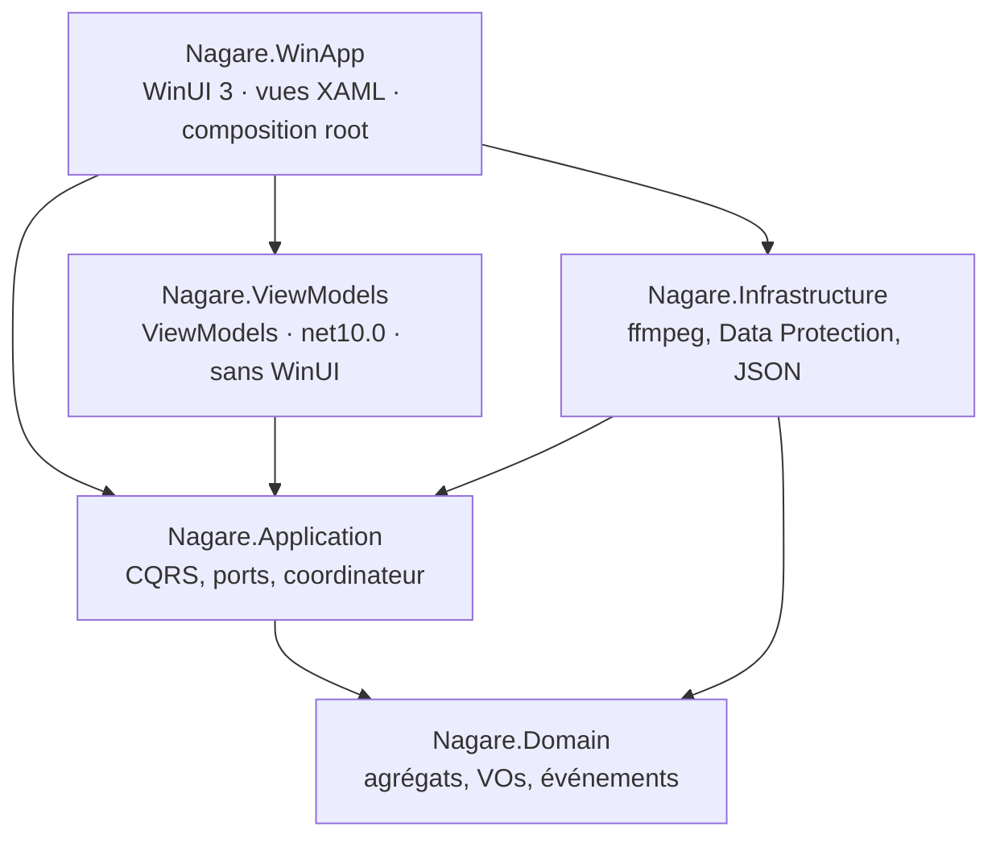

<div align="center">

# 流 Nagare

**Restreamer FFmpeg pour Twitch, YouTube et RTMP — application Windows native.**

Diffuse un fichier vidéo local en boucle vers la plateforme de votre choix,
avec un contrôle fin de l'encodage et un monitoring temps réel.

[](https://dotnet.microsoft.com/)
[](https://learn.microsoft.com/dotnet/csharp/)
[](tests/)
[](LICENSE)

</div>

---

## État du projet

**Les quatre couches sont livrées et l'application est utilisable** : une vraie
fenêtre Windows, pas un navigateur. Ce qui reste est du **soin d'interface**, pas
de la fonctionnalité.

| Couche | État |
|---|---|
| **Domain** — agrégats, machine à états, invariants | ✅ complet, testé |
| **Application** — CQRS, coordinateur de session | ✅ complet — coordinateur en boucle séquentielle sans verrou ([ADR-0008](docs/adr/0008-synchronisation-coordinateur.md)) |
| **Infrastructure** — ffmpeg, chiffrement, persistance | ✅ complet, testé |
| **Presentation** — interface Windows | ✅ **WinUI 3 natif** ([ADR-0006](docs/adr/0006-winui3-natif.md)) — 3 pages câblées, temps réel opérationnel |

La migration est terminée ; le plan et ses sept phases restent publics :
[`docs/plan-winui3-migration.md`](docs/plan-winui3-migration.md).

**Réserve d'honnêteté** : aucune **diffusion réelle** n'a encore été menée de bout
en bout — cela exige une clé de diffusion valide. La commande générée, elle, a été
validée contre un vrai ffmpeg. Le chantier ouvert est la **conception UX/UI**
([`docs/design/prompt-ux-ui.md`](docs/design/prompt-ux-ui.md)) : l'application
fonctionne, elle n'est pas encore agréable.

---

## Ce que fait Nagare

- **Profils d'encodage réutilisables** — codec (`h264_nvenc`, `hevc_nvenc`, `libx264`),
  preset, rate control (CBR/VBR), bitrate / maxrate / bufsize, GOP, résolution, fps ;
  audio (AAC, bitrate, sample rate). Les invariants sont **validés dans le domaine** :
  un profil incohérent ne peut pas exister.
- **Channels** — Twitch, YouTube ou RTMP custom. La clé de stream est **chiffrée au
  repos** et n'apparaît **jamais** en clair : ni dans les logs, ni dans l'UI, ni dans
  les messages d'erreur.
- **Construction de la commande ffmpeg** à partir du profil et du channel, avec
  **aperçu avant lancement** (clé masquée).
- **Pilotage du process** — démarrage, arrêt propre, annulation, capture de `stdout`/`stderr`,
  kill de ffmpeg à la fermeture de l'application.
- **Monitoring temps réel** — parsing de la sortie ffmpeg (`frame=`, `fps=`, `bitrate=`,
  `speed=`, drops) → statut de session et indicateur de santé (alerte si `speed < 1.0x`
  ou si les frames droppées augmentent).
- **Résilience** — détection de chute du flux, redémarrage automatique avec **backoff
  exponentiel** et abandon après N tentatives.

---

## Architecture

Clean Architecture + DDD + CQRS. Le `Domain` n'a **aucune dépendance** — pas même
`Microsoft.Extensions.*`.



Les **ViewModels vivent dans leur propre projet**, en `net10.0` et sans la moindre
dépendance WinUI — c'est ce qui les rend testables en ligne de commande, et ce qui
fait garantir **par le compilateur** qu'aucun type XAML ne fuit dans la logique de
présentation.

**Trois agrégats** : `StreamProfile` (profil d'encodage), `Channel` (destination + clé
protégée), `StreamSession` (diffusion en cours — une machine à états à 5 statuts qui
porte toute la logique de reconnexion).

Le modèle complet, en UML : [`docs/domain-model.md`](docs/domain-model.md).

**Pas de MediatR, pas de réflexion, pas de scan d'assembly.** Le CQRS repose sur
[BrilliantMediator](https://github.com/Monbsoft/BrilliantMediator), un mediator
*source-generated* ([ADR-0007](docs/adr/0007-brilliantmediator.md)).

---

## Sécurité de la clé de stream

C'est la donnée sensible du projet, et elle est traitée comme telle.

- **Chiffrée au repos** via ASP.NET Data Protection + **DPAPI** (`%APPDATA%\Nagare\keys`).
- Le `Domain` ne manipule qu'une **valeur opaque chiffrée** (`ProtectedStreamKey`) dont
  le `ToString()` renvoie `****` : un log accidentel est inoffensif par construction.
- ffmpeg **réaffiche l'URL complète — clé comprise — dans ses messages d'erreur**.
  Chaque ligne de sortie du process passe donc par un **scrubber** avant d'être loggée,
  bufferisée ou affichée. Aucun composant en aval ne voit une ligne brute.
- Les DTO exposés à l'UI ne portent jamais la clé, seulement un `bool KeyConfigured`.

Détails et limites assumées : [ADR-0005](docs/adr/0005-protection-cle-stream.md).

---

## Prérequis

- **[.NET 10 SDK](https://dotnet.microsoft.com/download)**
- **ffmpeg** et **ffprobe** — depuis le `PATH`, ou via un chemin configuré (voir ci-dessous)
- *(optionnel)* un **GPU NVIDIA** pour l'encodage matériel NVENC. À défaut, `libx264`
  (encodage logiciel) fonctionne.

Vérifier la disponibilité de NVENC :

```bash
ffmpeg -encoders | grep nvenc
```

---

## Démarrage

```bash
git clone https://github.com/oliver254/Nagare.git
cd Nagare
dotnet build Nagare.slnx
dotnet test  Nagare.slnx     # 260 tests
```

### Configurer ffmpeg

Si ffmpeg n'est pas dans le `PATH`, renseignez son chemin via les **User Secrets** —
**jamais** dans le dépôt :

```bash
cd src/Nagare.WinApp
dotnet user-secrets set "Nagare:Ffmpeg:ExecutablePath" "C:\chemin\vers\ffmpeg.exe"
dotnet user-secrets set "Nagare:Ffmpeg:FfprobePath"    "C:\chemin\vers\ffprobe.exe"
```

> ⚠️ Les User Secrets ne sont **pas chiffrés** : ils servent à *configurer*, pas à
> *stocker des secrets*. Les clés de stream de vos channels, elles, sont chiffrées par
> DPAPI. Cette frontière est expliquée dans [CONTRIBUTING.md](CONTRIBUTING.md).

---

## Structure

```
src/
  Nagare.Domain/           agrégats, value objects, machine à états, événements — zéro dépendance
  Nagare.Application/      CQRS (commands/queries/handlers), ports, coordinateur de session
  Nagare.Infrastructure/   FfmpegCommandBuilder, process runner, scrubber, DPAPI, persistance JSON
  Nagare.ViewModels/       ViewModels (net10.0, zéro dépendance WinUI — donc testables)
  Nagare.WinApp/           interface Windows (WinUI 3) : XAML, converters, services de plateforme
tests/
  Nagare.UnitTests/        260 tests
docs/
  SPEC.md                  spécification produit
  ARCHITECTURE.md          architecture détaillée, ports, contrats
  domain-model.md          modèle du domaine en UML (mermaid)
  adr/                     décisions d'architecture (8 ADR)
  design/                  conception UX/UI (chantier en cours)
  product/                 cadrage produit des features à venir
  plan-winui3-migration.md plan de migration — les 7 phases sont livrées
```

---

## Tests

La suite couvre ce qui casse en silence :

- un ***golden test*** qui vérifie que la commande générée reproduit la commande de
  référence **caractère pour caractère** ;
- la **non-fuite de la clé** sur tous les chemins de sortie (commande masquée, scrubber,
  `ToString()`) ;
- la **machine à états** : chaque transition autorisée émet son événement, chaque
  transition interdite lève une exception de domaine ;
- les **invariants d'encodage** (CBR ⇒ `maxrate == bitrate`, `bufsize ≥ bitrate`,
  `0 < keyint_min ≤ GOP`, dimensions paires…), cas valides **et** invalides ;
- le **coordinateur de session**, rendu déterministe par sa boucle séquentielle
  ([ADR-0008](docs/adr/0008-synchronisation-coordinateur.md)) : un faux runner pilote
  `Exited` et `StatsReceived` à la demande ;
- les **ViewModels**, y compris les garde-fous temps réel — les tests utilisent un
  dispatcher **différé**, car un dispatcher qui exécute en ligne prouverait qu'un code
  non marshallé « marche » aussi.

Ce sont ces tests qui ont révélé un bug réel : la reconnexion automatique ne fonctionnait
pas — le compteur de tentatives ne dépassait jamais 1, rendant la branche d'abandon
**inatteignable**. Voir [`#1`](https://github.com/oliver254/Nagare/pull/1).

Le `build` est configuré avec `TreatWarningsAsErrors`, audit NuGet compris : une
dépendance vulnérable **casse la compilation**.

---

## Contribuer

Conventions, workflow de branches et *Definition of Done* :
[CONTRIBUTING.md](CONTRIBUTING.md).

En bref : le code est en **anglais**, les documents en **français** ; une branche par
incrément ; `main` reste toujours verte ; toute décision structurante donne lieu à un
**ADR**.

---

## Licence

[MIT](LICENSE).

> Nagare **invoque** ffmpeg comme un process séparé et ne se lie pas aux bibliothèques
> `libav*` : la licence de ffmpeg ne se propage pas au projet. Assurez-vous simplement
> que le binaire ffmpeg que **vous** distribuez ou utilisez respecte sa propre licence
> (GPL ou LGPL selon le build).
