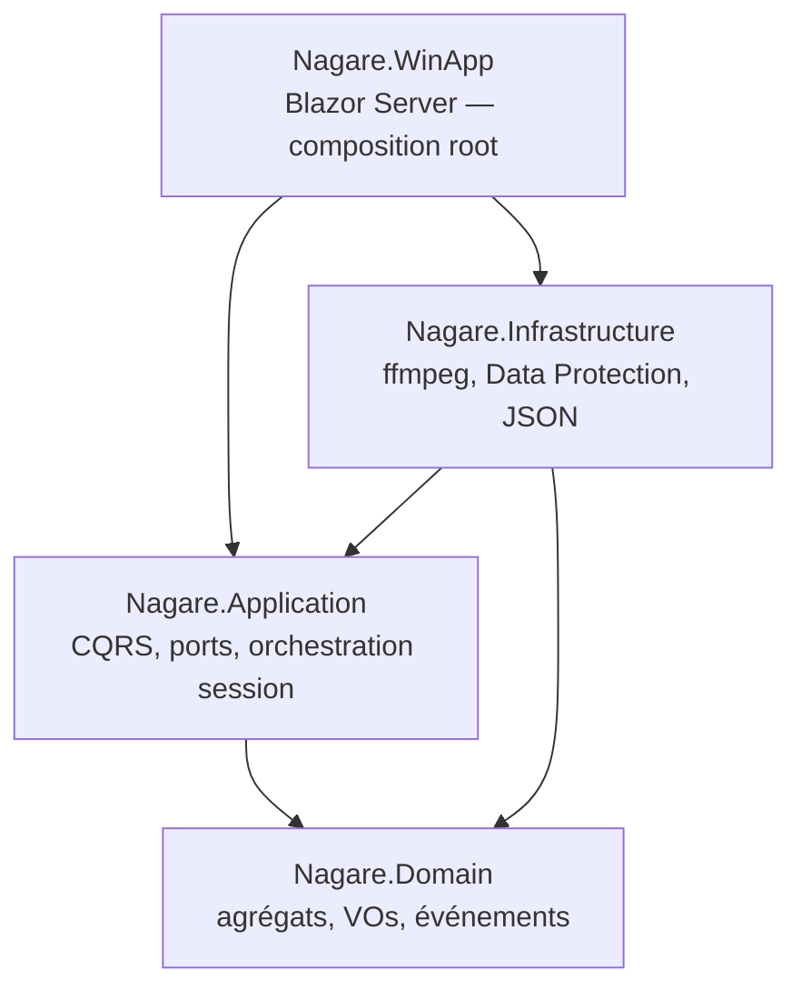
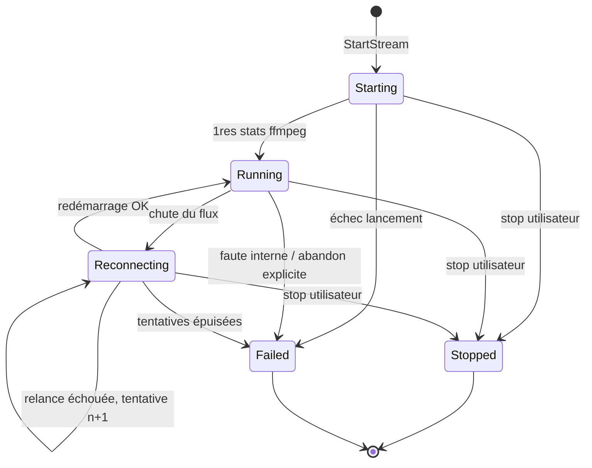
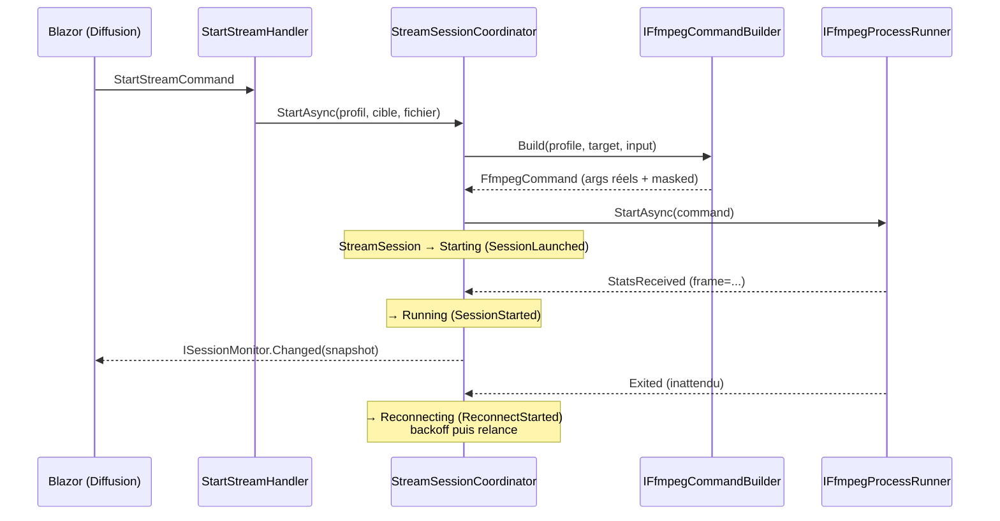

# Nagare — Architecture

> Document d'architecture (itération 1). Source fonctionnelle : `docs/SPEC.md`.
> Décisions actées dans `docs/adr/`. Ce document sert de plan d'implémentation
> direct pour `ada` (backend) et `blazor-ux` (front) — signatures et invariants
> précis, pas de corps de méthodes.

Cible : `net10.0` / C# 14 (ADR-0001). UI : Blazor Server local (ADR-0002).
CQRS maison sans MediatR (ADR-0003). Persistance JSON locale (ADR-0004).
Clé de stream chiffrée au repos, jamais en clair hors Infrastructure (ADR-0005).

---

## 1. Solution et dépendances entre couches

```
Nagare.sln
├── src/
│   ├── Nagare.Domain/           # aucune dépendance (pas même Microsoft.Extensions.*)
│   ├── Nagare.Application/      # → Nagare.Domain
│   ├── Nagare.Infrastructure/   # → Nagare.Application, Nagare.Domain
│   └── Nagare.WinApp/           # → tous (composition root, DI uniquement)
└── tests/
    └── Nagare.UnitTests/        # → Domain + Application + Infrastructure
```



Règles (DIP) :
- `Domain` ne référence rien. Zéro package NuGet.
- `Application` définit **tous les ports** (interfaces) ; `Infrastructure` les implémente.
- `Web` ne référence `Infrastructure` que pour appeler `services.AddNagareInfrastructure(...)`
  dans `Program.cs`. Les pages Blazor n'injectent que des handlers/contrats d'`Application`.

Arborescence interne indicative :

```
Nagare.Domain/
  Common/        AggregateRoot, IDomainEvent, DomainException, ids typés
  Profiles/      StreamProfile, EncodingSettings, AudioSettings, InputOptions, enums
  Channels/       Channel, Platform, ProtectedStreamKey
  Sessions/      StreamSession, SessionStatus, ReconnectPolicy, événements

Nagare.Application/
  Abstractions/  ICommandHandler, IQueryHandler, ports (voir §4)
  Profiles/      commands + queries + handlers + DTOs
  Channels/       idem
  Streaming/     StartStream/StopStream, StreamSessionCoordinator, SessionSnapshot
  Media/         ValidateMediaFileQuery, MediaInfo

Nagare.Infrastructure/
  Ffmpeg/        FfmpegCommandBuilder, FfmpegProcessRunner, FfmpegStatsParser,
                 FfprobeService, FfmpegEnvironmentProbe, StreamKeyScrubber
  Security/      DataProtectionStreamKeyProtector
  Persistence/   JsonFileStore, JsonStreamProfileRepository, JsonChannelRepository
  DependencyInjection.cs   (AddNagareInfrastructure)

Nagare.WinApp/
  Components/Pages/   Dashboard.razor, Profiles.razor, Channels.razor
  Program.cs
```

---

## 2. Domain — modélisation DDD

Langage : **le code est intégralement en anglais** (types, membres, namespaces,
fichiers, statuts, événements, commentaires) — décision utilisateur du 2026-07-06.
Le français reste la langue des documents (SPEC, ADR, le présent document) et,
par défaut, des textes affichés dans l'UI. Les statuts/événements nommés en
français ci-dessous décrivent les concepts ; leurs identifiants code sont anglais
(ex. « En cours » → `Running`, « Reconnexion » → `Reconnecting`).

### 2.1 Ids typés et briques communes

```csharp
public readonly record struct ProfileId(Guid Value);
public readonly record struct ChannelId(Guid Value);
public readonly record struct SessionId(Guid Value);

public interface IDomainEvent { DateTimeOffset OccurredAt { get; } }

public abstract class AggregateRoot
{
    private readonly List<IDomainEvent> _domainEvents = [];
    public IReadOnlyList<IDomainEvent> DomainEvents { get; }   // lecture seule
    public void ClearDomainEvents();
    protected void RaiseDomainEvent(IDomainEvent evt);
}

public sealed class DomainException : Exception { } // invariant violé
```

### 2.2 `StreamProfile` — agrégat (persisté)

Profil d'encodage nommé, réutilisable. Racine d'agrégat sans entité enfant :
trois VOs immuables.

```csharp
public sealed class StreamProfile : AggregateRoot
{
    public ProfileId Id { get; }
    public string Name { get; private set; }             // invariant : non vide, trimé
    public EncodingSettings Video { get; private set; }
    public AudioSettings Audio { get; private set; }
    public InputOptions Input { get; private set; }

    public static StreamProfile Create(string name, EncodingSettings video,
        AudioSettings audio, InputOptions input);
    public void Update(string name, EncodingSettings video,
        AudioSettings audio, InputOptions input);
}
```

#### `EncodingSettings` (VO — record immuable, validation au constructeur)

```csharp
public enum VideoCodec { H264Nvenc, HevcNvenc, Libx264 }   // → h264_nvenc, hevc_nvenc, libx264
public enum RateControl { Cbr, Vbr }
public readonly record struct Resolution(int Width, int Height);

public sealed record EncodingSettings(
    VideoCodec Codec,
    string Preset,
    RateControl RateControl,
    int BitrateKbps,
    int MaxrateKbps,
    int BufsizeKbps,
    int GopSize,          // -g
    int KeyintMin,        // -keyint_min
    Resolution? Resolution,   // optionnel → -vf scale=W:H
    int? Fps);                // optionnel → -r
```

Invariants (levée de `DomainException` sinon) :
| # | Invariant | Raison |
|---|---|---|
| E1 | `BitrateKbps > 0`, `MaxrateKbps > 0`, `BufsizeKbps > 0` | valeurs ffmpeg valides |
| E2 | `RateControl == Cbr` ⇒ `MaxrateKbps == BitrateKbps` | définition du CBR |
| E3 | `RateControl == Vbr` ⇒ `MaxrateKbps >= BitrateKbps` | plafond cohérent |
| E4 | `BufsizeKbps >= BitrateKbps` | buffer VBV cohérent pour du live RTMP (reco Twitch/YouTube : 1×–2× le bitrate) |
| E5 | `GopSize > 0` et `0 < KeyintMin <= GopSize` | ffmpeg clampe sinon silencieusement |
| E6 | `Preset` ∈ presets connus du codec : NVENC → `p1`…`p7` ; libx264 → `ultrafast, superfast, veryfast, faster, fast, medium, slow, slower, veryslow` | échec ffmpeg précoce évité |
| E7 | `Resolution` présente ⇒ `Width > 0`, `Height > 0`, tous deux **pairs** | exigence des encodeurs h264/hevc |
| E8 | `Fps` présent ⇒ `> 0` | valeur ffmpeg valide |

#### `AudioSettings` (VO)

```csharp
public enum AudioCodec { Aac }   // extensible plus tard

public sealed record AudioSettings(AudioCodec Codec, int BitrateKbps, int SampleRateHz);
```

Invariants : `BitrateKbps > 0` ; `SampleRateHz` ∈ { 44100, 48000 } (valeurs
acceptées par les plateformes RTMP ciblées — à élargir si un besoin réel apparaît).

#### `InputOptions` (VO)

```csharp
public sealed record InputOptions(bool ReadAtNativeRate, bool LoopInfinitely);
// ReadAtNativeRate → -re ; LoopInfinitely → -stream_loop -1
// Défaut métier : (true, true) — exposé par InputOptions.Default
```

### 2.3 `Channel` — agrégat (persisté)

```csharp
public enum Platform { Twitch, YouTube, CustomRtmp }

public sealed class Channel : AggregateRoot
{
    public ChannelId Id { get; }
    public string Name { get; private set; }             // non vide
    public Platform Platform { get; private set; }
    public string BaseUrl { get; private set; }          // invariant : schéma rtmp:// ou rtmps://
    public ProtectedStreamKey Key { get; private set; }  // JAMAIS le clair

    public static Channel Create(string name, Platform platform,
        string baseUrl, ProtectedStreamKey key);
    public static Channel Restore(ChannelId id, string name, Platform platform,
        string baseUrl, ProtectedStreamKey key);         // rechargement depuis la persistance
    public void Update(string name, Platform platform, string baseUrl);
    public void ReplaceKey(ProtectedStreamKey newKey);
}
```

#### `ProtectedStreamKey` (VO — décision détaillée en ADR-0005)

Le Domain ne représente **que le chiffré**, comme valeur opaque. Le clair
n'existe jamais dans Domain ni Application (hors transit opaque, voir §4.2).

```csharp
public sealed record ProtectedStreamKey
{
    public string CipherText { get; }        // payload Data Protection, base64
    public const string Mask = "****";
    public override string ToString() => Mask;     // pit of success : un log accidentel affiche ****
    // pas de propriété exposant un clair — Unprotect vit en Infrastructure
}
```

Invariant : `CipherText` non vide. `ToString()` masqué rend inoffensifs
interpolation de chaîne, log structuré ou message d'exception accidentels.

URLs de base par défaut (suggestions UI, pas des invariants) : Twitch
`rtmp://live.twitch.tv/app`, YouTube `rtmp://a.rtmp.youtube.com/live2` —
constantes dans `Platform`-helpers du Domain, éditables par l'utilisateur.

### 2.4 `StreamSession` — agrégat avec machine à états (non persisté en itération 1)

Représente une diffusion en cours. Vit en mémoire (singleton applicatif, §5) ;
l'historique de sessions est hors périmètre itération 1.

```csharp
public enum SessionStatus { Starting, Running, Reconnecting, Stopped, Failed }

public sealed record ReconnectPolicy
{
    public int MaxAttempts { get; }        // > 0
    public TimeSpan InitialDelay { get; }  // > 0
    public double Factor { get; }          // >= 1.0 (backoff exponentiel)
    public TimeSpan MaxDelay { get; }      // >= InitialDelay

    public static ReconnectPolicy Default => new(5, TimeSpan.FromSeconds(2), 2.0, TimeSpan.FromSeconds(60));
    public TimeSpan DelayFor(int attempt); // min(InitialDelay × Factor^(n-1), MaxDelay), n ≥ 1
}

public sealed class StreamSession : AggregateRoot
{
    public SessionId Id { get; }
    public ProfileId ProfileId { get; }
    public ChannelId ChannelId { get; }
    public string InputFilePath { get; }
    public SessionStatus Status { get; private set; }
    public int ReconnectAttempts { get; private set; }
    public ReconnectPolicy Policy { get; }
    public string? LastError { get; private set; }   // toujours passée au scrubbing (§6.3)

    public static StreamSession Launch(ProfileId profileId, ChannelId channelId,
        string inputFilePath, ReconnectPolicy policy);   // → Starting + SessionLaunched

    public void MarkRunning();                    // Starting|Reconnecting → Running (remet le compteur à 0)
    public void BeginReconnect(string reason);    // Running|Reconnecting → Reconnecting (ou → Failed si tentatives épuisées)
    public void Stop();                           // Starting|Running|Reconnecting → Stopped
    public void MarkFailed(string reason);        // Starting|Running|Reconnecting → Failed (abandon explicite)
    // Toute transition non listée ⇒ DomainException (garde explicite par état)
}
```

#### Transitions autorisées

| De | Vers | Déclencheur | Événement émis |
|---|---|---|---|
| — (création) | `Starting` | `StartStreamCommand` | `SessionLaunched` |
| `Starting` | `Running` | 1ʳᵉ ligne de stats ffmpeg (`frame=`) | `SessionStarted` |
| `Starting` | `Failed` | échec de lancement (exit précoce, RTMP refusé, GPU indispo) | `SessionFailed` |
| `Starting` | `Stopped` | stop utilisateur pendant le démarrage | `SessionStopped` |
| `Running` | `Reconnecting` | chute détectée (exit inattendu du process) — tentative 1 | `ReconnectStarted` |
| `Running` | `Stopped` | stop utilisateur | `SessionStopped` |
| `Running` | `Failed` | faute interne / abandon explicite (`MarkFailed`) | `SessionFailed` |
| **`Reconnecting`** | **`Reconnecting`** | **relance morte avant les stats — tentative n+1** | **`ReconnectStarted`** |
| `Reconnecting` | `Running` | redémarrage ffmpeg réussi (remet le compteur à 0) | `SessionRecovered` |
| `Reconnecting` | `Failed` | tentatives épuisées (`attempt > MaxAttempts`) | `SessionFailed` |
| `Reconnecting` | `Stopped` | stop utilisateur | `SessionStopped` |
| `Stopped` / `Failed` | — | états terminaux : on relance via une **nouvelle** session | — |

Choix assumé : un échec **initial** (état `Starting`) ne déclenche pas le
backoff — la config est probablement fautive (clé invalide, fichier illisible) ;
la reconnexion automatique est réservée aux chutes d'un flux déjà établi
(c'est le sens de « détection de chute » dans la spec).

**`Running → Failed` n'est PAS un raccourci pour les sorties de ffmpeg.** Une
chute d'un flux établi passe toujours par `BeginReconnect` et **consomme le budget
de reconnexion** : c'est la règle ci-dessus, inchangée. Cette transition est
l'**abandon explicite**, déclenché par une faute interne du coordinateur (le seul
appelant), quand plus rien ne peut faire avancer la session — sans elle, une
session `Running` devenue impilotable resterait un **zombie**. L'alternative
(passer par `BeginReconnect` pour atteindre `Failed`) émettait un `ReconnectStarted`
**mensonger** : les événements de domaine sont la piste d'audit de la session, et
une tentative de reconnexion qui n'a jamais eu lieu n'a rien à y faire.

**L'auto-transition `Reconnecting → Reconnecting` est le cœur du backoff** : chaque
relance qui meurt avant d'émettre des stats consomme une tentative de plus, avec
un délai `Policy.DelayFor(n)` croissant. Une reconnexion réussie restaure le budget
complet. Sans elle, la ligne `Reconnecting → Failed` serait **inatteignable** —
c'était le cas jusqu'au commit `41856d9` (bug révélé par les tests).



### 2.5 Événements de domaine

```csharp
public sealed record SessionLaunched(SessionId Id, ProfileId ProfileId, ChannelId ChannelId, DateTimeOffset OccurredAt) : IDomainEvent;
public sealed record SessionStarted(SessionId Id, DateTimeOffset OccurredAt) : IDomainEvent;
public sealed record ReconnectStarted(SessionId Id, int Attempt, TimeSpan NextDelay, string Reason, DateTimeOffset OccurredAt) : IDomainEvent;
public sealed record SessionRecovered(SessionId Id, int AfterAttempts, DateTimeOffset OccurredAt) : IDomainEvent;
public sealed record SessionStopped(SessionId Id, DateTimeOffset OccurredAt) : IDomainEvent;
public sealed record SessionFailed(SessionId Id, string Reason, DateTimeOffset OccurredAt) : IDomainEvent;
```

`Raison` est toujours un texte **déjà scrubbbé** (la clé de stream ne peut pas
s'y trouver — voir §6.3) : l'appelant (coordinateur) est responsable du scrubbing
avant d'appeler les méthodes de transition.

**Stratégie de dispatch (volontairement minimale)** : pas de bus, pas de
réflexion. L'agrégat accumule ses événements (`AggregateRoot.DomainEvents`) ;
après chaque transition, le `StreamSessionCoordinator` (Application, §5) draine
la collection (`ClearDomainEvents`) et les publie **explicitement** :
notification UI (`ISessionMonitor.Changed`) et logs applicatifs. Si un jour un
deuxième consommateur métier apparaît, on introduira
`IDomainEventHandler<TEvent>` résolu par DI — pas avant (YAGNI).

---

## 3. Application — CQRS sans MediatR (ADR-0003)

### 3.1 Interfaces maison

```csharp
public interface ICommandHandler<in TCommand>
{
    Task HandleAsync(TCommand command, CancellationToken ct);
}
public interface ICommandHandler<in TCommand, TResult>
{
    Task<TResult> HandleAsync(TCommand command, CancellationToken ct);
}
public interface IQueryHandler<in TQuery, TResult>
{
    Task<TResult> HandleAsync(TQuery query, CancellationToken ct);
}
```

Enregistrement DI **explicite, un par un** (pas de scan d'assembly) dans
`Nagare.Application.DependencyInjection.AddNagareApplication()`. Les composants
Blazor injectent directement `ICommandHandler<StartStreamCommand, SessionId>` etc.

### 3.2 Commands / Queries — itération 1

| Command | Entrée | Résultat | Notes |
|---|---|---|---|
| `SaveStreamProfileCommand` | `ProfileId?` (null = création) + nom + settings | `ProfileId` | upsert |
| `DeleteStreamProfileCommand` | `ProfileId` | — | refusée si profil utilisé par la session active |
| `SaveChannelCommand` | `ChannelId?`, `Name`, `Platform`, `BaseUrl`, `string? PlaintextKey` | `ChannelId` | clé protégée dans le handler via `IStreamKeyProtector` puis oubliée ; `null` = clé inchangée |
| `DeleteChannelCommand` | `ChannelId` | — | idem garde session active |
| `StartStreamCommand` | `ProfileId`, `ChannelId`, `InputFilePath` | `SessionId` | délègue au coordinateur ; refuse si une session est déjà active |
| `StopStreamCommand` | — (session unique) | — | arrêt propre (§6.2) |

| Query | Entrée | Résultat |
|---|---|---|
| `GetStreamProfilesQuery` | — | `IReadOnlyList<StreamProfileDto>` |
| `GetChannelsQuery` | — | `IReadOnlyList<ChannelDto>` — le DTO ne contient **jamais** la clé, seulement `bool KeyConfigured` |
| `GetSessionStatusQuery` | — | `SessionSnapshot?` |
| `GetSessionLogsQuery` | `int MaxLines` | `IReadOnlyList<string>` (lignes scrubbées) |
| `ValidateMediaFileQuery` | `string FilePath` | `MediaValidationResult` (existe, lisible, durée, résolution, fps, codecs) |
| `BuildCommandPreviewQuery` | `ProfileId`, `ChannelId`, `InputFilePath` | `string` — ligne de commande **masquée** (spec : afficher avant lancement) |
| `GetFfmpegEnvironmentQuery` | — | `FfmpegEnvironmentReport` (check au démarrage : binaires + NVENC) |

### 3.3 Contrats de lecture

```csharp
public sealed record FfmpegStats(long Frame, double Fps, double BitrateKbps,
    double Speed, int DroppedFrames, int DupFrames, TimeSpan Time);

public enum HealthIndicator { Ok, Warning }   // Warning si Speed < 1.0 ou drops croissants

public sealed record SessionSnapshot(SessionId Id, SessionStatus Status,
    FfmpegStats? Stats, HealthIndicator Health, int ReconnectAttempts,
    string? LastError);
```

---

## 4. Ports (définis dans `Nagare.Application.Abstractions`)

ISP appliqué : petites interfaces ciblées, pas de `IRepository<T>` générique.

### 4.1 Persistance

```csharp
public interface IStreamProfileRepository
{
    Task<IReadOnlyList<StreamProfile>> GetAllAsync(CancellationToken ct);
    Task<StreamProfile?> GetByIdAsync(ProfileId id, CancellationToken ct);
    Task SaveAsync(StreamProfile profile, CancellationToken ct);   // upsert
    Task DeleteAsync(ProfileId id, CancellationToken ct);
}
public interface IChannelRepository   // même forme, sur Channel/ChannelId
```

### 4.2 ffmpeg / ffprobe

```csharp
/// Résultat du builder. ToString() => MaskedCommandLine (jamais les vrais arguments).
/// Arguments et Secrets ne doivent JAMAIS être loggés ni sérialisés :
/// ils transitent opaques du builder (Infra) au runner (Infra) via le handler (App).
public sealed record FfmpegCommand(
    IReadOnlyList<string> Arguments,      // arguments réels, clé en clair incluse
    string MaskedCommandLine,             // version affichable, clé remplacée par ****
    IReadOnlyList<string> Secrets)        // valeurs à scrubber dans toute sortie process
{
    public override string ToString() => MaskedCommandLine;
}

public interface IFfmpegCommandBuilder
{
    /// Mapping profil + cible + fichier → arguments ffmpeg, ordre canonique STRICT (§6.1).
    /// Déchiffre la clé en interne (IStreamKeyProtector) — le clair ne sort que
    /// dans Arguments/Secrets, opaques par convention.
    FfmpegCommand Build(StreamProfile profile, Channel target, string inputFilePath);
}

public interface IFfmpegProcessRunner : IAsyncDisposable
{
    Task StartAsync(FfmpegCommand command, CancellationToken ct);
    /// Arrêt propre : 'q' sur stdin, attente gracePeriod, sinon Kill(entireProcessTree: true).
    Task StopAsync(TimeSpan gracePeriod, CancellationToken ct);
    bool IsRunning { get; }
    event Action<string> OutputLineReceived;   // lignes stderr/stdout DÉJÀ scrubbées (§6.3)
    event Action<FfmpegStats> StatsReceived;   // lignes de progression parsées
    event Action<int> Exited;                  // code de sortie
}

public interface IFfprobeService
{
    Task<MediaValidationResult> AnalyzeAsync(string filePath, CancellationToken ct);
}

public interface IFfmpegEnvironmentProbe
{
    /// Check au démarrage : ffmpeg/ffprobe présents (chemin configuré, sinon PATH),
    /// version, et disponibilité NVENC via `ffmpeg -encoders`.
    Task<FfmpegEnvironmentReport> CheckAsync(CancellationToken ct);
}
```

### 4.3 Protection de la clé (ADR-0005)

```csharp
public interface IStreamKeyProtector
{
    ProtectedStreamKey Protect(string plaintextKey);
    string Unprotect(ProtectedStreamKey key);   // appelé UNIQUEMENT par l'Infrastructure
}
```

Frontière : `Protect` est appelé une seule fois, dans le handler
`SaveChannelCommand` (le clair vient du formulaire, vit le temps du
handler, n'est jamais stocké ni loggé). `Unprotect` n'est appelé que par
`FfmpegCommandBuilder` (Infrastructure), au moment de construire la commande.

### 4.4 Monitoring pour l'UI

```csharp
public interface ISessionMonitor
{
    SessionSnapshot? Current { get; }
    IReadOnlyList<string> RecentLogs(int maxLines);
    event Action<SessionSnapshot> Changed;   // transitions + stats (throttlées côté coordinateur)
    event Action<string> LogAppended;
}
```

Implémenté par le `StreamSessionCoordinator` lui-même (§5). Les pages Blazor
s'y abonnent (`InvokeAsync(StateHasChanged)`) et se désabonnent au `Dispose`.

---

## 5. `StreamSessionCoordinator` (Application, singleton)

Pièce centrale du runtime — les handlers `StartStream`/`StopStream` lui délèguent :

- Détient la `StreamSession` active (**une seule session à la fois** en
  itération 1 — invariant applicatif, pas domaine).
- Charge profil + cible, fait construire la `FfmpegCommand`, démarre le runner.
- S'abonne aux événements du runner :
  - 1ʳᵉ `StatsReceived` → `session.MarkRunning()` ;
  - `Exited` inattendu → `session.BeginReconnect(reason)` puis relance avec backoff
    exponentiel (`Policy.DelayFor(n)` = min(InitialDelay × Factor^(n-1), MaxDelay)) ;
  - relance qui meurt **avant** les stats → `session.BeginReconnect(reason)` à nouveau
    (auto-transition `Reconnecting → Reconnecting`, tentative n+1) ; à l'épuisement
    des tentatives, l'agrégat bascule lui-même en `Failed` ;
  - relance réussie → `session.MarkRunning()`, qui remet `ReconnectAttempts` à 0.
- Après chaque transition : draine `DomainEvents`, publie via `ISessionMonitor.Changed`.
- Tient le buffer circulaire de logs (capacité configurable, défaut 1000 lignes).
- `IHostedService`/`IAsyncDisposable` : kill du process ffmpeg à la fermeture
  de l'app (exigence spec §5).

`ReconnectPolicy` par défaut lue dans `appsettings.json`
(`Nagare:Reconnect:{MaxTentatives,DelaiInitialSeconds,Facteur,DelaiMaxSeconds}`).



---

## 6. Infrastructure — contrats d'implémentation

### 6.1 `FfmpegCommandBuilder` — ordre canonique STRICT

Doit reproduire **exactement** le format de la spec (ordre inclus). Table de
mapping, dans cet ordre :

| # | Source | Argument(s) émis | Condition |
|---|---|---|---|
| 1 | `Input.ReadAtNativeRate` | `-re` | si `true` |
| 2 | `Input.LoopInfinitely` | `-stream_loop -1` | si `true` |
| 3 | fichier d'entrée | `-i <inputFilePath>` | toujours |
| 4 | `Video.Codec` | `-c:v h264_nvenc \| hevc_nvenc \| libx264` | toujours |
| 5 | `Video.Preset` | `-preset <preset>` | toujours |
| 6 | `Video.RateControl` | `-rc cbr \| vbr` | **NVENC uniquement** (libx264 n'a pas `-rc` ; son CBR est déjà exprimé par b:v = maxrate + bufsize) |
| 7 | `Video.BitrateKbps` | `-b:v <N>k` | toujours |
| 8 | `Video.MaxrateKbps` | `-maxrate <N>k` | toujours |
| 9 | `Video.BufsizeKbps` | `-bufsize <N>k` | toujours |
| 10 | `Video.GopSize` | `-g <N>` | toujours |
| 11 | `Video.KeyintMin` | `-keyint_min <N>` | toujours |
| 12 | `Video.Resolution` | `-vf scale=<W>:<H>` | si présente |
| 13 | `Video.Fps` | `-r <N>` | si présent |
| 14 | `Audio.Codec` | `-c:a aac` | toujours |
| 15 | `Audio.BitrateKbps` | `-b:a <N>k` | toujours |
| 16 | `Audio.SampleRateHz` | `-ar <N>` | toujours |
| 17 | format conteneur | `-f flv` | toujours |
| 18 | destination | `<BaseUrl sans '/' final>/<clé en clair>` | dernier argument |

`MaskedCommandLine` : même construction, clé remplacée par
`ProtectedStreamKey.Mask` (`****`). `Secrets` = `[ cléEnClair ]`.

Test « golden » obligatoire : profil (h264_nvenc, p2, CBR, 3000/3000/3000,
g=60, keyint_min=60, sans résolution/fps ; aac 128k 48000 ; -re + loop) + cible
→ reproduit **caractère pour caractère** l'exemple de la spec.

### 6.2 `FfmpegProcessRunner`

- Wrappe `System.Diagnostics.Process` : `RedirectStandardError/Output/Input`,
  lecture ligne à ligne asynchrone (ffmpeg écrit sa progression sur **stderr**).
- Arrêt propre : écrire `q` sur stdin → attendre `gracePeriod` (défaut 5 s) →
  `Kill(entireProcessTree: true)`. Annulation par `CancellationToken` à chaque étape.
- Chemins binaires : `Nagare:Ffmpeg:ExecutablePath` / `Nagare:Ffmpeg:FfprobePath`
  dans `appsettings.json` ; fallback PATH (rappel addendum : ffmpeg absent du
  PATH sur la machine de dev — le chemin configuré est la voie nominale).
- `FfmpegStatsParser` (classe interne, pure, testée unitairement) : parse
  `frame= fps= bitrate= speed= drop= dup= time=` → `FfmpegStats`.

### 6.3 `StreamKeyScrubber` — règle de sécurité transverse

ffmpeg **répète l'URL de sortie (clé incluse) dans ses messages d'erreur**
(ex. `rtmp://…/live_xxx: Connection refused`). Donc : toute ligne sortie du
process est passée dans le scrubber (remplacement de chaque valeur de
`FfmpegCommand.Secrets` par `****`) **avant** d'être émise par
`OutputLineReceived`, bufferisée, loggée ou insérée dans `LastError` /
`SessionFailed.Reason`. Aucun autre composant ne voit de ligne non scrubbée.
Test unitaire dédié.

### 6.4 Persistance JSON (ADR-0004)

- `JsonFileStore` : lecture/écriture `System.Text.Json`, **écriture atomique**
  (fichier temporaire + `File.Replace`), verrou applicatif (`SemaphoreSlim`).
- Fichiers : `%APPDATA%\Nagare\profiles.json`, `%APPDATA%\Nagare\targets.json`.
  La clé y figure sous forme `ProtectedStreamKey.CipherText` (chiffrée au repos).
- Les repositories mappent agrégats ↔ DTOs de stockage privés (le Domain
  n'expose pas de setters pour la désérialisation).

### 6.5 `DataProtectionStreamKeyProtector` (ADR-0005)

ASP.NET Core Data Protection, purpose `"Nagare.StreamKey.v1"`, keyring persisté
sous `%APPDATA%\Nagare\keys` et protégé par **DPAPI** (Windows d'abord — l'API
`IStreamKeyProtector` isole ce choix OS-spécifique, conformément à la spec).

---

## 7. Web (Blazor Server) — itération 1

| Page | Contenu | Handlers consommés |
|---|---|---|
| `Diffusion` (accueil) | sélection fichier (chemin + validation ffprobe), choix profil, choix chaîne, **aperçu commande masquée**, Start/Stop, statut de session, logs live | `ValidateMediaFileQuery`, `GetStreamProfilesQuery`, `GetChannelsQuery`, `BuildCommandPreviewQuery`, `StartStreamCommand`, `StopStreamCommand`, `ISessionMonitor` |
| `Profils` | CRUD profils d'encodage (formulaire settings vidéo/audio/entrée) | `GetStreamProfilesQuery`, `SaveStreamProfileCommand`, `DeleteStreamProfileCommand` |
| `Chaînes` | CRUD chaînes ; champ clé en `type=password`, jamais réaffichée (seulement « clé configurée ») | `GetChannelsQuery`, `SaveChannelCommand`, `DeleteChannelCommand` |

Au démarrage (`Program.cs` + bandeau UI) : `GetFfmpegEnvironmentQuery` →
avertissement si ffmpeg/ffprobe introuvables ou NVENC indisponible alors qu'un
profil NVENC existe. L'app reste utilisable (configuration des profils/cibles)
même sans ffmpeg.

App locale mono-utilisateur : bind sur `localhost` uniquement ; pas d'authentification
en itération 1 (surface d'attaque = boucle locale ; à réévaluer si exposition réseau).

---

## 8. Tests (`Nagare.UnitTests`, xUnit)

Exigences spec — sans exécuter de binaire ffmpeg :

1. **FfmpegCommandBuilder** : golden test de l'exemple exact de la spec ;
   variantes (libx264 sans `-rc`, résolution/fps optionnels, toggles `-re`/loop,
   BaseUrl avec/sans `/` final) ; `MaskedCommandLine` ne contient jamais la clé.
2. **StreamSession** : chaque transition autorisée (+ événement émis) ; chaque
   transition interdite ⇒ `DomainException` ; compteur/épuisement des tentatives.
3. **Invariants VOs** : `EncodingSettings` (E1–E8), `AudioSettings`, `ReconnectPolicy`.
4. **FfmpegStatsParser** : lignes de progression réelles, lignes non-stats ignorées.
5. **StreamKeyScrubber** : la clé disparaît de toute ligne, y compris dans une URL.
6. `ProtectedStreamKey.ToString()` == `****`.

Le protecteur Data Protection et les repositories JSON se testeront en
intégration plus tard (hors périmètre itération 1).
