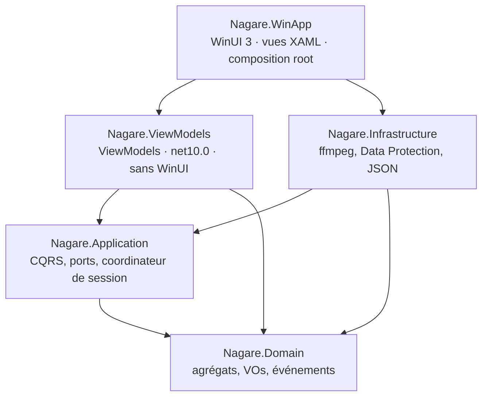
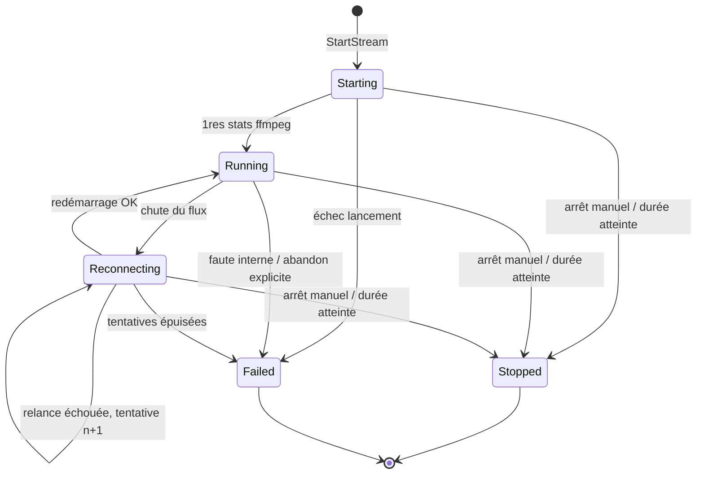
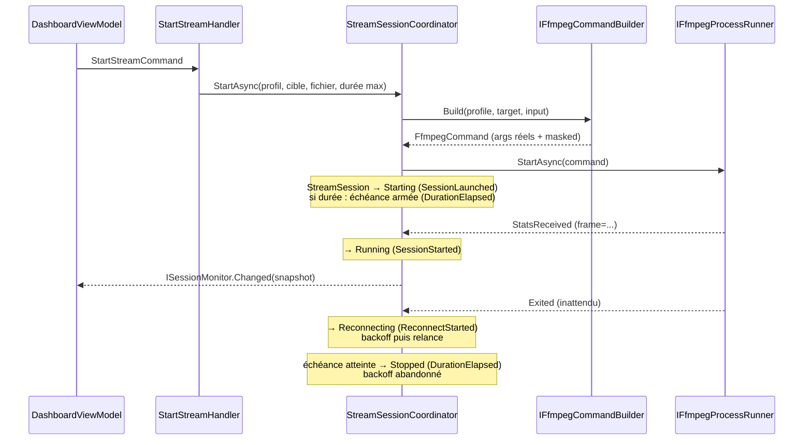

# Nagare — Architecture

> Document d'architecture. Source fonctionnelle : `docs/SPEC.md`.
> Décisions actées dans `docs/adr/`. Signatures et invariants précis, pas de
> corps de méthodes.

Cible : `net10.0` / C# 14 (ADR-0001). UI : **WinUI 3 natif, non empaqueté**
(ADR-0006 — **remplace** l'ADR-0002 Blazor Server). CQRS via **BrilliantMediator**
source-generated (ADR-0007 — **remplace** l'ADR-0003 handlers maison). Persistance
JSON locale (ADR-0004). Clé de stream chiffrée au repos, jamais en clair hors
Infrastructure (ADR-0005). Coordinateur en boucle séquentielle sans verrou (ADR-0008).
Durée maximale de diffusion et arrêt programmé (ADR-0009).

---

## 1. Solution et dépendances entre couches

```
Nagare.slnx
├── src/
│   ├── Nagare.Domain/           # aucune dépendance (pas même Microsoft.Extensions.*)
│   ├── Nagare.Application/      # → Nagare.Domain (+ BrilliantMediator.Abstractions)
│   ├── Nagare.Infrastructure/   # → Nagare.Application, Nagare.Domain
│   ├── Nagare.ViewModels/       # → Application + Domain. ViewModels, net10.0, ZÉRO WinUI
│   └── Nagare.WinApp/           # → tous (composition root). WinUI 3, TFM Windows
└── tests/
    └── Nagare.UnitTests/        # → Domain + Application + Infrastructure + ViewModels
```



> **`Shell/ShutdownGuard` n'est pas un ViewModel**, et c'est assumé. Il séquence les demandes de
> fermeture contre l'arrêt asynchrone de l'hôte — la règle « ffmpeg ne survit jamais à la fenêtre »
> (SPEC §5). Elle vivait en ligne dans `App.xaml.cs`, où **rien n'est testable** : `Nagare.WinApp`
> cible un TFM Windows que `Nagare.UnitTests` ne peut pas référencer. Elle s'y est trompée une fois
> — un second clic sur la croix fermait la fenêtre pour de vrai et laissait ffmpeg diffuser. Une
> règle que la spec qualifie de non négociable mérite un test : elle a donc déménagé là où les tests
> l'atteignent. Aucun type WinUI n'entre ici, la fenêtre et l'hôte sont deux délégués.

> **Pourquoi `Nagare.ViewModels`.** Dans les conventions .NET (Ardalis, Jason Taylor), le mot
> « Presentation » désigne l'**hôte** — ici `Nagare.WinApp`. Le projet des ViewModels portait
> autrefois ce nom : il annonçait donc son voisin, tout en ne contenant ni XAML ni fenêtre —
> trois ViewModels, leur classe de base et deux ports. Il s'appelle maintenant ce qu'il contient.

Règles (DIP) :
- `Domain` ne référence rien. Zéro package NuGet.
- `Application` définit **tous les ports** (interfaces) ; `Infrastructure` les implémente.
- `WinApp` ne référence `Infrastructure` que pour appeler `services.AddNagareInfrastructure(...)`
  dans `App.xaml.cs`. Les ViewModels n'injectent que `IMediator` et des contrats d'`Application`.

### Pourquoi `Nagare.ViewModels` est un projet séparé

L'argument longtemps affiché ici — « sinon les ViewModels seraient intestables, car
`Nagare.WinApp` cible un TFM Windows » — est **faux**, et il vaut la peine de le dire :
il aurait suffi de fusionner les ViewModels dans `Nagare.Application` (qui cible
`net10.0`) pour que les tests les atteignent. L'argument ne défend donc rien.

La vraie raison est une **frontière de dépendances**, et elle tient en trois points.

1. **`Application` ne doit dépendre ni d'une bibliothèque MVVM ni du thread UI.**
   `CommunityToolkit.Mvvm` (`ObservableObject`, `[RelayCommand]`) est une technologie de
   *binding*, et `IUiDispatcher` est la notion même de *thread UI* : deux choses dont la
   couche métier n'a aucune idée à avoir.

2. **Et ces dépendances couleraient EN TRANSITIF dans `Infrastructure`.** C'est le point
   décisif, et il est vérifiable : `Infrastructure` référence `Application`, donc tout paquet
   déclaré dans `Application` apparaît dans ses dépendances résolues. Constaté sur
   `BrilliantMediator`, déclaré dans `Application` **seul** :

   ```
   $ dotnet list src/Nagare.Infrastructure/Nagare.Infrastructure.csproj package --include-transitive
      > BrilliantMediator      3.0.0        (transitif)
   ```

   Fusionner les ViewModels dans `Application`, c'est donc livrer une bibliothèque de binding
   MVVM au **runner ffmpeg** et aux dépôts JSON. Le compilateur ne s'y opposerait pas : rien
   n'empêcherait plus `FfmpegProcessRunner` d'hériter d'`ObservableObject`.

3. **La frontière « les ViewModels ne parlent au métier que par `IMediator` » (ADR-0007) est
   aujourd'hui garantie par le compilateur.** `Nagare.ViewModels` ne référence pas
   `Infrastructure` : un ViewModel ne *peut pas* appeler un dépôt ou ffmpeg directement, même
   par erreur. Fusionner les couches dégraderait cette garantie mécanique en simple
   **convention** — c'est-à-dire en quelque chose qui se viole un vendredi soir.

La testabilité, elle, n'est pas la cause : c'est une **conséquence** agréable de cette
séparation (les ViewModels sont en `net10.0`, `Nagare.UnitTests` les référence sans WinUI).

Les ViewModels ne connaissent qu'`IMediator`, `ISessionMonitor` et deux abstractions maison
(`IUiDispatcher`, `IVideoFilePicker`), implémentées côté `WinApp`. `Nagare.WinApp` ne
garde que le XAML, les converters, l'interop HWND et le composition root.

Arborescence interne indicative :

```
Nagare.Domain/
  Common/        AggregateRoot, IDomainEvent, DomainException, ids typés
  Profiles/      StreamProfile, EncodingSettings, AudioSettings, InputOptions, enums
  Channels/       Channel, Platform, ProtectedStreamKey
  Sessions/      StreamSession, SessionStatus, SessionStopReason, ReconnectPolicy, événements

Nagare.Application/
  Abstractions/  ports (voir §4), SessionSnapshot, FfmpegStats, DTOs de lecture
  Profiles/      commands + queries + handlers + DTOs
  Channels/       idem
  Streaming/     StartStream/StopStream, StreamSessionCoordinator, StreamOperationException
  Media/         ValidateMediaFileQuery, MediaInfo

Nagare.Infrastructure/
  Ffmpeg/        FfmpegCommandBuilder, FfmpegProcessRunner, FfmpegStatsParser,
                 FfprobeService, FfmpegEnvironmentProbe, StreamKeyScrubber
  Security/      DataProtectionStreamKeyProtector
  Persistence/   JsonFileStore, JsonStreamProfileRepository, JsonChannelRepository
  DependencyInjection.cs   (AddNagareInfrastructure)

Nagare.ViewModels/            # net10.0, AUCUNE dépendance WinUI
  DashboardViewModel, ProfilesViewModel, ChannelsViewModel, ViewModelBase
  Abstractions/  IUiDispatcher, IVideoFilePicker   (implémentés côté WinApp)
  Shell/         ShutdownGuard   (séquencement de l'arrêt — SPEC §5)
  DependencyInjection.cs   (AddNagareViewModels, CreateDashboard)

Nagare.WinApp/                # WinUI 3, TFM Windows
  App.xaml(.cs)  composition root : Host builder, config (JSON + User Secrets), DI
  MainWindow     shell : NavigationView
  Views/         DashboardPage, ProfilesPage, ChannelsPage  (XAML)
  Services/      UiDispatcher (DispatcherQueue), FilePickerService (interop HWND)
  Converters/
```

---

## 2. Domain — modélisation DDD

Langage : **le code est intégralement en anglais** (types, membres, namespaces,
fichiers, statuts, événements, commentaires) — décision utilisateur du 2026-07-06.
Le français reste la langue des documents (SPEC, ADR, le présent document) et,
par défaut, des textes affichés dans l'UI. Les statuts/événements nommés en
français ci-dessous décrivent les concepts ; leurs identifiants code sont anglais
(ex. « En cours » → `Running`, « Reconnexion » → `Reconnecting`).

### 2.1 Ids typés et briques communes

```csharp
public readonly record struct ProfileId(Guid Value);
public readonly record struct ChannelId(Guid Value);
public readonly record struct SessionId(Guid Value);

public interface IDomainEvent { DateTimeOffset OccurredAt { get; } }

public abstract class AggregateRoot
{
    private readonly List<IDomainEvent> _domainEvents = [];
    public IReadOnlyList<IDomainEvent> DomainEvents { get; }   // lecture seule
    public void ClearDomainEvents();
    protected void RaiseDomainEvent(IDomainEvent evt);
}

public sealed class DomainException : Exception { } // invariant violé
```

### 2.2 `StreamProfile` — agrégat (persisté)

Profil d'encodage nommé, réutilisable. Racine d'agrégat sans entité enfant :
trois VOs immuables.

```csharp
public sealed class StreamProfile : AggregateRoot
{
    public ProfileId Id { get; }
    public string Name { get; private set; }             // invariant : non vide, trimé
    public EncodingSettings Video { get; private set; }
    public AudioSettings Audio { get; private set; }
    public InputOptions Input { get; private set; }

    public static StreamProfile Create(string name, EncodingSettings video,
        AudioSettings audio, InputOptions input);
    public void Update(string name, EncodingSettings video,
        AudioSettings audio, InputOptions input);
}
```

#### `EncodingSettings` (VO — record immuable, validation au constructeur)

```csharp
public enum VideoCodec { H264Nvenc, HevcNvenc, Libx264 }   // → h264_nvenc, hevc_nvenc, libx264
public enum RateControl { Cbr, Vbr }
public readonly record struct Resolution(int Width, int Height);

public sealed record EncodingSettings(
    VideoCodec Codec,
    string Preset,
    RateControl RateControl,
    int BitrateKbps,
    int MaxrateKbps,
    int BufsizeKbps,
    int GopSize,          // -g
    int KeyintMin,        // -keyint_min
    Resolution? Resolution,   // optionnel → -vf scale=W:H
    int? Fps);                // optionnel → -r
```

Invariants (levée de `DomainException` sinon) :
| # | Invariant | Raison |
|---|---|---|
| E1 | `BitrateKbps > 0`, `MaxrateKbps > 0`, `BufsizeKbps > 0` | valeurs ffmpeg valides |
| E2 | `RateControl == Cbr` ⇒ `MaxrateKbps == BitrateKbps` | définition du CBR |
| E3 | `RateControl == Vbr` ⇒ `MaxrateKbps >= BitrateKbps` | plafond cohérent |
| E4 | `BufsizeKbps >= BitrateKbps` | buffer VBV cohérent pour du live RTMP (reco Twitch/YouTube : 1×–2× le bitrate) |
| E5 | `GopSize > 0` et `0 < KeyintMin <= GopSize` | ffmpeg clampe sinon silencieusement |
| E6 | `Preset` ∈ presets connus du codec : NVENC → `p1`…`p7` ; libx264 → `ultrafast, superfast, veryfast, faster, fast, medium, slow, slower, veryslow` | échec ffmpeg précoce évité |
| E7 | `Resolution` présente ⇒ `Width > 0`, `Height > 0`, tous deux **pairs** | exigence des encodeurs h264/hevc |
| E8 | `Fps` présent ⇒ `> 0` | valeur ffmpeg valide |

#### `AudioSettings` (VO)

```csharp
public enum AudioCodec { Aac }   // extensible plus tard

public sealed record AudioSettings(AudioCodec Codec, int BitrateKbps, int SampleRateHz);
```

Invariants : `BitrateKbps > 0` ; `SampleRateHz` ∈ { 44100, 48000 } (valeurs
acceptées par les plateformes RTMP ciblées — à élargir si un besoin réel apparaît).

#### `InputOptions` (VO)

```csharp
public sealed record InputOptions(bool ReadAtNativeRate, bool LoopInfinitely);
// ReadAtNativeRate → -re ; LoopInfinitely → -stream_loop -1
// Défaut métier : (true, true) — exposé par InputOptions.Default
```

### 2.3 `Channel` — agrégat (persisté)

```csharp
public enum Platform { Twitch, YouTube, CustomRtmp }

public sealed class Channel : AggregateRoot
{
    public ChannelId Id { get; }
    public string Name { get; private set; }             // non vide
    public Platform Platform { get; private set; }
    public string BaseUrl { get; private set; }          // invariant : schéma rtmp:// ou rtmps://
    public ProtectedStreamKey Key { get; private set; }  // JAMAIS le clair

    public static Channel Create(string name, Platform platform,
        string baseUrl, ProtectedStreamKey key);
    public static Channel Restore(ChannelId id, string name, Platform platform,
        string baseUrl, ProtectedStreamKey key);         // rechargement depuis la persistance
    public void Update(string name, Platform platform, string baseUrl);
    public void ReplaceKey(ProtectedStreamKey newKey);
}
```

#### `ProtectedStreamKey` (VO — décision détaillée en ADR-0005)

Le Domain ne représente **que le chiffré**, comme valeur opaque. Le clair
n'existe jamais dans Domain ni Application (hors transit opaque, voir §4.2).

```csharp
public sealed record ProtectedStreamKey
{
    public string CipherText { get; }        // payload Data Protection, base64
    public const string Mask = "****";
    public override string ToString() => Mask;     // pit of success : un log accidentel affiche ****
    // pas de propriété exposant un clair — Unprotect vit en Infrastructure
}
```

Invariant : `CipherText` non vide. `ToString()` masqué rend inoffensifs
interpolation de chaîne, log structuré ou message d'exception accidentels.

URLs de base par défaut (suggestions UI, pas des invariants) : Twitch
`rtmp://live.twitch.tv/app`, YouTube `rtmp://a.rtmp.youtube.com/live2` —
constantes dans `Platform`-helpers du Domain, éditables par l'utilisateur.

### 2.4 `StreamSession` — agrégat avec machine à états (non persisté en itération 1)

Représente une diffusion en cours. Vit en mémoire (singleton applicatif, §5) ;
l'historique de sessions est hors périmètre itération 1.

```csharp
public enum SessionStatus { Starting, Running, Reconnecting, Stopped, Failed }

/// Pourquoi une session s'est arrêtée (ADR-0009). Un échec n'est PAS un arrêt :
/// une session Failed garde StopReason == null.
public enum SessionStopReason { Manual, DurationElapsed }

public sealed record ReconnectPolicy
{
    public int MaxAttempts { get; }        // > 0
    public TimeSpan InitialDelay { get; }  // > 0
    public double Factor { get; }          // >= 1.0 (backoff exponentiel)
    public TimeSpan MaxDelay { get; }      // >= InitialDelay

    public static ReconnectPolicy Default => new(5, TimeSpan.FromSeconds(2), 2.0, TimeSpan.FromSeconds(60));
    public TimeSpan DelayFor(int attempt); // min(InitialDelay × Factor^(n-1), MaxDelay), n ≥ 1
}

public sealed class StreamSession : AggregateRoot
{
    /// Garde-fou anti-faute de frappe, exposé pour que l'UI borne sa saisie avec
    /// la MÊME valeur que l'invariant (ADR-0009).
    public static readonly TimeSpan MaxAllowedDuration = TimeSpan.FromHours(24);

    public SessionId Id { get; }
    public ProfileId ProfileId { get; }
    public ChannelId ChannelId { get; }
    public string InputFilePath { get; }
    public SessionStatus Status { get; private set; }
    public int ReconnectAttempts { get; private set; }
    public ReconnectPolicy Policy { get; }
    public TimeSpan? MaxDuration { get; }                  // null = diffusion sans limite
    public SessionStopReason? StopReason { get; private set; }   // null tant que non arrêtée
    public string? LastError { get; private set; }   // toujours passée au scrubbing (§6.3)

    public static StreamSession Launch(ProfileId profileId, ChannelId channelId,
        string inputFilePath, ReconnectPolicy policy,
        TimeSpan? maxDuration = null);                   // → Starting + SessionLaunched

    public void MarkRunning();                    // Starting|Reconnecting → Running (remet le compteur à 0)
    public void BeginReconnect(string reason);    // Running|Reconnecting → Reconnecting (ou → Failed si tentatives épuisées)
    public void Stop(SessionStopReason reason);   // Starting|Running|Reconnecting → Stopped
    public void MarkFailed(string reason);        // Starting|Running|Reconnecting → Failed (abandon explicite)
    // Toute transition non listée ⇒ DomainException (garde explicite par état)
}
```

Invariants de durée (ADR-0009 ; `DomainException` sinon) :
| # | Invariant | Raison |
|---|---|---|
| S1 | `maxDuration` présente ⇒ `> TimeSpan.Zero` | une fenêtre nulle ou négative n'a pas de sens (US-0 : saisie refusée) |
| S2 | `maxDuration` présente ⇒ `<= MaxAllowedDuration` | garde-fou anti-faute de frappe, pas une limite produit |
| S3 | `Stop(DurationElapsed)` ⇒ `MaxDuration is not null` | une session sans limite ne peut pas s'arrêter « pour durée atteinte » ; un déclencheur périmé qui l'atteindrait est un bug, et il échoue bruyamment |

**L'agrégat ne lit aucune horloge pour décider.** Il porte l'*intention*
(`MaxDuration`) ; l'*instant* de fin (`PlannedEndsAt`) est calculé et surveillé
par le coordinateur, seul détenteur d'un `TimeProvider` (ADR-0009 §1 et §3).

#### Transitions autorisées

| De | Vers | Déclencheur | Événement émis |
|---|---|---|---|
| — (création) | `Starting` | `StartStreamCommand` | `SessionLaunched` |
| `Starting` | `Running` | 1ʳᵉ ligne de stats ffmpeg (`frame=`) | `SessionStarted` |
| `Starting` | `Failed` | échec de lancement (exit précoce, RTMP refusé, GPU indispo) | `SessionFailed` |
| `Starting` | `Stopped` | arrêt manuel ou durée atteinte pendant le démarrage | `SessionStopped` |
| `Running` | `Reconnecting` | chute détectée (exit inattendu du process) — tentative 1 | `ReconnectStarted` |
| `Running` | `Stopped` | arrêt manuel ou durée atteinte | `SessionStopped` |
| `Running` | `Failed` | faute interne / abandon explicite (`MarkFailed`) | `SessionFailed` |
| **`Reconnecting`** | **`Reconnecting`** | **relance morte avant les stats — tentative n+1** | **`ReconnectStarted`** |
| `Reconnecting` | `Running` | redémarrage ffmpeg réussi (remet le compteur à 0) | `SessionRecovered` |
| `Reconnecting` | `Failed` | tentatives épuisées (`attempt > MaxAttempts`) | `SessionFailed` |
| `Reconnecting` | `Stopped` | arrêt manuel, ou durée atteinte — l'arrêt programmé gagne sur le backoff | `SessionStopped` |
| `Stopped` / `Failed` | — | états terminaux : on relance via une **nouvelle** session | — |

Choix assumé : un échec **initial** (état `Starting`) ne déclenche pas le
backoff — la config est probablement fautive (clé invalide, fichier illisible) ;
la reconnexion automatique est réservée aux chutes d'un flux déjà établi
(c'est le sens de « détection de chute » dans la spec).

**L'arrêt programmé n'ajoute aucune transition** (ADR-0009) : il emprunte les
mêmes `→ Stopped`, avec `SessionStopReason.DurationElapsed` au lieu de `Manual`.
C'est ce qui rend l'arbitrage D du cadrage (`Reconnecting → Stopped` à
l'échéance, tentatives abandonnées) applicable sans toucher la machine à états.

**`Running → Failed` n'est PAS un raccourci pour les sorties de ffmpeg.** Une
chute d'un flux établi passe toujours par `BeginReconnect` et **consomme le budget
de reconnexion** : c'est la règle ci-dessus, inchangée. Cette transition est
l'**abandon explicite**, déclenché par une faute interne du coordinateur (le seul
appelant), quand plus rien ne peut faire avancer la session — sans elle, une
session `Running` devenue impilotable resterait un **zombie**. L'alternative
(passer par `BeginReconnect` pour atteindre `Failed`) émettait un `ReconnectStarted`
**mensonger** : les événements de domaine sont la piste d'audit de la session, et
une tentative de reconnexion qui n'a jamais eu lieu n'a rien à y faire.

**L'auto-transition `Reconnecting → Reconnecting` est le cœur du backoff** : chaque
relance qui meurt avant d'émettre des stats consomme une tentative de plus, avec
un délai `Policy.DelayFor(n)` croissant. Une reconnexion réussie restaure le budget
complet. Sans elle, la ligne `Reconnecting → Failed` serait **inatteignable** —
c'était le cas jusqu'au commit `41856d9` (bug révélé par les tests).



### 2.5 Événements de domaine

```csharp
public sealed record SessionLaunched(SessionId Id, ProfileId ProfileId, ChannelId ChannelId, DateTimeOffset OccurredAt) : IDomainEvent;
public sealed record SessionStarted(SessionId Id, DateTimeOffset OccurredAt) : IDomainEvent;
public sealed record ReconnectStarted(SessionId Id, int Attempt, TimeSpan NextDelay, string Reason, DateTimeOffset OccurredAt) : IDomainEvent;
public sealed record SessionRecovered(SessionId Id, int AfterAttempts, DateTimeOffset OccurredAt) : IDomainEvent;
public sealed record SessionStopped(SessionId Id, SessionStopReason Reason, DateTimeOffset OccurredAt) : IDomainEvent;
public sealed record SessionFailed(SessionId Id, string Reason, DateTimeOffset OccurredAt) : IDomainEvent;
```

`Raison` est toujours un texte **déjà scrubbbé** (la clé de stream ne peut pas
s'y trouver — voir §6.3) : l'appelant (coordinateur) est responsable du scrubbing
avant d'appeler les méthodes de transition. La `Reason` de `SessionStopped` fait
exception : c'est un `SessionStopReason`, pas un texte — rien à scrubber.

**Stratégie de dispatch (volontairement minimale)** : pas de bus, pas de
réflexion. L'agrégat accumule ses événements (`AggregateRoot.DomainEvents`) ;
après chaque transition, le `StreamSessionCoordinator` (Application, §5) draine
la collection (`ClearDomainEvents`) et les publie **explicitement** :
notification UI (`ISessionMonitor.Changed`) et logs applicatifs. Si un jour un
deuxième consommateur métier apparaît, on introduira
`IDomainEventHandler<TEvent>` résolu par DI — pas avant (YAGNI).

---

## 3. Application — CQRS via BrilliantMediator (ADR-0007)

### 3.1 Contrats

> ⚠️ **Remplace l'ADR-0003** (interfaces `ICommandHandler`/`IQueryHandler` maison,
> enregistrées une par une). Ces interfaces **n'existent plus**.

Les messages portent les marqueurs de la lib (`Monbsoft.BrilliantMediator.Abstractions`) :

```csharp
public sealed record StartStreamCommand(ProfileId ProfileId, ChannelId ChannelId,
    string InputFilePath, TimeSpan? MaxDuration)
    : ICommand<SessionId>;

public sealed record GetChannelsQuery : IQuery<IReadOnlyList<ChannelDto>>;

public sealed class StartStreamHandler(IStreamSessionCoordinator coordinator)
    : ICommandHandler<StartStreamCommand, SessionId>
{
    public Task<SessionId> Handle(StartStreamCommand command, CancellationToken ct = default) => …;
}
```

Enregistrement : `AddBrilliantMediator().AddGeneratedHandlers().Build()` dans
`AddNagareApplication()`, puis `UseBrilliantMediator()` au composition root. Les
handlers sont découverts **à la compilation** par le source generator — **pas de
réflexion, pas de scan d'assembly**.

Les **ViewModels injectent un unique `IMediator`** :

```csharp
await _mediator.DispatchAsync<StartStreamCommand, SessionId>(command, ct);   // écriture
await _mediator.SendAsync<GetChannelsQuery, IReadOnlyList<ChannelDto>>(query, ct);   // lecture
```

Les **événements de domaine ne passent pas** par `IEvent`/`PublishAsync` : ils restent
collectés sur l'agrégat et drainés par le coordinateur (§5). On ne mélange pas
événements de domaine et pub/sub applicatif.

### 3.2 Commands / Queries — itération 1

| Command | Entrée | Résultat | Notes |
|---|---|---|---|
| `SaveStreamProfileCommand` | `ProfileId?` (null = création) + nom + settings | `ProfileId` | upsert |
| `DeleteStreamProfileCommand` | `ProfileId` | — | refusée si profil utilisé par la session active |
| `SaveChannelCommand` | `ChannelId?`, `Name`, `Platform`, `BaseUrl`, `string? PlaintextKey` | `ChannelId` | clé protégée dans le handler via `IStreamKeyProtector` puis oubliée ; `null` = clé inchangée |
| `DeleteChannelCommand` | `ChannelId` | — | idem garde session active |
| `StartStreamCommand` | `ProfileId`, `ChannelId`, `InputFilePath`, `TimeSpan? MaxDuration` | `SessionId` | délègue au coordinateur ; refuse si une session est déjà active. `MaxDuration` : durée maximale de diffusion, `null` = sans limite ; bornes validées par le domaine (S1–S2, ADR-0009) |
| `StopStreamCommand` | — (session unique) | — | arrêt **manuel** (§6.2) — `SessionStopReason.Manual` |

| Query | Entrée | Résultat |
|---|---|---|
| `GetStreamProfilesQuery` | — | `IReadOnlyList<StreamProfileDto>` |
| `GetChannelsQuery` | — | `IReadOnlyList<ChannelDto>` — le DTO ne contient **jamais** la clé, seulement `bool KeyConfigured` |
| `GetSessionStatusQuery` | — | `SessionSnapshot?` |
| `GetSessionLogsQuery` | `int MaxLines` | `IReadOnlyList<string>` (lignes scrubbées) |
| `ValidateMediaFileQuery` | `string FilePath` | `MediaValidationResult` (existe, lisible, durée, résolution, fps, codecs) |
| `BuildCommandPreviewQuery` | `ProfileId`, `ChannelId`, `InputFilePath` | `string` — ligne de commande **masquée** (spec : afficher avant lancement) |
| `GetFfmpegEnvironmentQuery` | — | `FfmpegEnvironmentReport` (check au démarrage : binaires + NVENC) |
| `GetStartPreflightQuery` | `FfmpegEnvironmentReport?`, `StreamProfileDto?`, `ChannelDto?`, `string? InputFilePath`, `MediaValidationResult?` | `StartPreflight` — **la** règle « peut-on démarrer ? », rendue comme un `StartBlockReason` structuré (voir ci-dessous) |

#### `GetStartPreflightQuery` — la politique de démarrage

La règle « peut-on lancer cette diffusion ? » vivait dans le `DashboardViewModel`, écrite en
phrases françaises, jusqu'au **nom d'une clé de configuration ffmpeg**. Elle est ici, et le
ViewModel ne fait plus que **traduire le motif en phrase** et exposer `CanStart`.

`StartBlockReason` : `None`, `NotChecked`, `FfmpegMissing`, `FfprobeMissing`, `NvencUnavailable`,
`SessionAlreadyActive`, `ProfileNotSelected`, `ChannelNotSelected`, `InputFileNotSelected`,
`InputFileNotFound`, `InputFileUnreadable`.

Deux choix méritent d'être écrits :

- **Les faits coûteux sont passés EN ENTRÉE, pas relus par le handler.** Le rapport
  d'environnement coûte trois lancements de processus, le rapport ffprobe un quatrième. La query
  est réévaluée à **chaque changement de sélection** : les relire ferait naître quatre processus
  à chaque clic dans une ComboBox. Ils sont collectés une fois par leurs propres queries et
  transmis. *Cacher* est de la plomberie (elle reste chez l'appelant) ; *décider* est la règle
  (elle est ici). Le seul fait lu en direct est « une session tourne-t-elle ? »
  (`ISessionMonitor`) : lui seul peut changer sous les pieds de l'appelant.
- **L'ordre d'évaluation est signifiant** : ce qui est *cassé* (toolchain, fichier illisible,
  profil NVENC sur machine sans NVENC) prime sur ce qui n'est *pas encore fait* (pas de profil,
  pas de channel, pas de fichier). Classer « pas de channel » avant « ce fichier est corrompu »
  **masquerait** l'erreur de fichier à quiconque choisit son fichier avant son channel.

`NotChecked` n'est pas `None` : « pas de verdict » ne doit jamais se lire « feu vert ». C'est
aussi ce qui garde le bouton éteint pendant l'instant où une vérification est en vol.

**La durée maximale n'entre PAS dans le preflight** (ADR-0009 §4) : c'est un invariant du
domaine (S1–S2), pas un fait externe. L'UI borne sa saisie avec
`StreamSession.MaxAllowedDuration` et affiche la `DomainException` si une valeur fautive
passe malgré tout — la règle n'existe qu'à un seul endroit.

### 3.3 Contrats de lecture

```csharp
public sealed record FfmpegStats(long Frame, double Fps, double BitrateKbps,
    double Speed, int DroppedFrames, int DupFrames, TimeSpan Time);

public enum HealthIndicator { Ok, Warning }   // Warning si Speed < 1.0 ou drops croissants

public sealed record SessionSnapshot(SessionId Id, SessionStatus Status,
    FfmpegStats? Stats, HealthIndicator Health, int ReconnectAttempts,
    string? LastError,
    DateTimeOffset? PlannedEndsAt,       // fin programmée, null = diffusion sans limite
    SessionStopReason? StopReason);      // null tant que la session n'est pas arrêtée
```

`PlannedEndsAt` est détenu par le coordinateur (et non par l'agrégat, ADR-0009) :
il **survit à la réhydratation** du dashboard, ce qu'un chronomètre local ne
ferait pas. Le **temps restant n'est pas publié** : c'est une valeur qui s'égrène,
la vue la dérive de `PlannedEndsAt` — la publier imposerait un snapshot par
seconde, contre le throttle de §4.4.

---

## 4. Ports (définis dans `Nagare.Application.Abstractions`)

ISP appliqué : petites interfaces ciblées, pas de `IRepository<T>` générique.

### 4.1 Persistance

```csharp
public interface IStreamProfileRepository
{
    Task<IReadOnlyList<StreamProfile>> GetAllAsync(CancellationToken ct);
    Task<StreamProfile?> GetByIdAsync(ProfileId id, CancellationToken ct);
    Task SaveAsync(StreamProfile profile, CancellationToken ct);   // upsert
    Task DeleteAsync(ProfileId id, CancellationToken ct);
}
public interface IChannelRepository   // même forme, sur Channel/ChannelId
```

### 4.2 ffmpeg / ffprobe

```csharp
/// Résultat du builder. ToString() => MaskedCommandLine (jamais les vrais arguments).
/// Arguments et Secrets ne doivent JAMAIS être loggés ni sérialisés :
/// ils transitent opaques du builder (Infra) au runner (Infra) via le handler (App).
public sealed record FfmpegCommand(
    IReadOnlyList<string> Arguments,      // arguments réels, clé en clair incluse
    string MaskedCommandLine,             // version affichable, clé remplacée par ****
    IReadOnlyList<string> Secrets)        // valeurs à scrubber dans toute sortie process
{
    public override string ToString() => MaskedCommandLine;
}

public interface IFfmpegCommandBuilder
{
    /// Mapping profil + cible + fichier → arguments ffmpeg, ordre canonique STRICT (§6.1).
    /// Déchiffre la clé en interne (IStreamKeyProtector) — le clair ne sort que
    /// dans Arguments/Secrets, opaques par convention.
    FfmpegCommand Build(StreamProfile profile, Channel target, string inputFilePath);
}

public interface IFfmpegProcessRunner : IAsyncDisposable
{
    Task StartAsync(FfmpegCommand command, CancellationToken ct);
    /// Arrêt propre : 'q' sur stdin, attente gracePeriod, sinon Kill(entireProcessTree: true).
    Task StopAsync(TimeSpan gracePeriod, CancellationToken ct);
    bool IsRunning { get; }
    event Action<string> OutputLineReceived;   // lignes stderr/stdout DÉJÀ scrubbées (§6.3)
    event Action<FfmpegStats> StatsReceived;   // lignes de progression parsées
    event Action<int> Exited;                  // code de sortie
}

public interface IFfprobeService
{
    Task<MediaValidationResult> AnalyzeAsync(string filePath, CancellationToken ct);
}

public interface IFfmpegEnvironmentProbe
{
    /// Check au démarrage : ffmpeg/ffprobe présents (chemin configuré, sinon PATH),
    /// version, et disponibilité NVENC via `ffmpeg -encoders`.
    Task<FfmpegEnvironmentReport> CheckAsync(CancellationToken ct);
}
```

### 4.3 Protection de la clé (ADR-0005)

```csharp
public interface IStreamKeyProtector
{
    ProtectedStreamKey Protect(string plaintextKey);
    string Unprotect(ProtectedStreamKey key);   // appelé UNIQUEMENT par l'Infrastructure
}
```

Frontière : `Protect` est appelé une seule fois, dans le handler
`SaveChannelCommand` (le clair vient du formulaire, vit le temps du
handler, n'est jamais stocké ni loggé). `Unprotect` n'est appelé que par
`FfmpegCommandBuilder` (Infrastructure), au moment de construire la commande.

### 4.4 Monitoring pour l'UI

```csharp
public interface ISessionMonitor
{
    SessionSnapshot? Current { get; }
    IReadOnlyList<string> RecentLogs(int maxLines);
    event Action<SessionSnapshot> Changed;   // transitions + stats (throttlées côté coordinateur)
    event Action<string> LogAppended;
}
```

Implémenté par le `StreamSessionCoordinator` lui-même (§5).

⚠️ **`Changed` et `LogAppended` sont levés depuis le thread de la boucle mailbox du
coordinateur, jamais depuis le thread UI.** Le `DashboardViewModel` doit donc
**marshaller** chaque mise à jour (`IUiDispatcher` → `DispatcherQueue.TryEnqueue`).
Toucher une `ObservableCollection` depuis le thread lecteur de `stderr` donne un
`RPC_E_WRONG_THREAD` — ou pire, une corruption silencieuse.

Deux garde-fous **non négociables** côté ViewModel (plan §5), sans lesquels l'UI
**gèle** sous le débit de ffmpeg :
- **logs** : ring buffer **borné** (500 lignes) + `ListView` **virtualisée**, et les
  lignes d'une rafale sont **coalescées en un seul** callback dispatcher ;
- **stats** : **throttle à ~1 màj/s**. Le changement de **statut**, lui, passe
  immédiatement (il change rarement).

Le ViewModel se **désabonne** au `Dispose` (appelé à l'`Unloaded` de la page). Le
coordinateur **isole les exceptions des abonnés** : une UI qui lève ne peut pas faire
échouer une session de diffusion en cours.

---

## 5. `StreamSessionCoordinator` (Application, singleton)

Pièce centrale du runtime — les handlers `StartStream`/`StopStream` lui délèguent :

- Détient la `StreamSession` active (**une seule session à la fois** en
  itération 1 — invariant applicatif, pas domaine).
- Charge profil + cible, fait construire la `FfmpegCommand`, démarre le runner.
- S'abonne aux événements du runner :
  - 1ʳᵉ `StatsReceived` → `session.MarkRunning()` ;
  - `Exited` inattendu → `session.BeginReconnect(reason)` puis relance avec backoff
    exponentiel (`Policy.DelayFor(n)` = min(InitialDelay × Factor^(n-1), MaxDelay)) ;
  - relance qui meurt **avant** les stats → `session.BeginReconnect(reason)` à nouveau
    (auto-transition `Reconnecting → Reconnecting`, tentative n+1) ; à l'épuisement
    des tentatives, l'agrégat bascule lui-même en `Failed` ;
  - relance réussie → `session.MarkRunning()`, qui remet `ReconnectAttempts` à 0.
- **Détient l'échéance de la session bornée** (ADR-0009) : à la création de la
  session, si `MaxDuration` est présente, il calcule `PlannedEndsAt` avec son
  `TimeProvider` et arme — **hors de la boucle**, sur le `_sessionCts` — un délai
  qui repostera un message `DurationElapsed(SessionId)`. À réception, il arrête la
  session avec `SessionStopReason.DurationElapsed`, par le **même chemin d'arrêt**
  que le stop manuel (mêmes barrières ADR-0008). Le message est taggé par le
  **`SessionId`, jamais par l'epoch** : l'epoch est une génération de *runner*, il
  change à chaque sortie de ffmpeg, et l'échéance doit survivre aux reconnexions.
- Après chaque transition : draine `DomainEvents`, publie via `ISessionMonitor.Changed`.
- Tient le buffer circulaire de logs (capacité configurable, défaut 1000 lignes).
- `IHostedService`/`IAsyncDisposable` : kill du process ffmpeg à la fermeture
  de l'app (exigence spec §5).

`ReconnectPolicy` par défaut lue dans `appsettings.json`, section `Nagare:Reconnect` :
`MaxAttempts` (5), `InitialDelaySeconds` (2), `Factor` (2), `MaxDelaySeconds` (60).
La durée maximale, elle, n'est **pas** configurée : elle est saisie par
l'utilisateur à chaque lancement (ou absente).



---

## 6. Infrastructure — contrats d'implémentation

### 6.1 `FfmpegCommandBuilder` — ordre canonique STRICT

Doit reproduire **exactement** le format de la spec (ordre inclus). Table de
mapping, dans cet ordre :

| # | Source | Argument(s) émis | Condition |
|---|---|---|---|
| 1 | `Input.ReadAtNativeRate` | `-re` | si `true` |
| 2 | `Input.LoopInfinitely` | `-stream_loop -1` | si `true` |
| 3 | fichier d'entrée | `-i <inputFilePath>` | toujours |
| 4 | `Video.Codec` | `-c:v h264_nvenc \| hevc_nvenc \| libx264` | toujours |
| 5 | `Video.Preset` | `-preset <preset>` | toujours |
| 6 | `Video.RateControl` | `-rc cbr \| vbr` | **NVENC uniquement** (libx264 n'a pas `-rc` ; son CBR est déjà exprimé par b:v = maxrate + bufsize) |
| 7 | `Video.BitrateKbps` | `-b:v <N>k` | toujours |
| 8 | `Video.MaxrateKbps` | `-maxrate <N>k` | toujours |
| 9 | `Video.BufsizeKbps` | `-bufsize <N>k` | toujours |
| 10 | `Video.GopSize` | `-g <N>` | toujours |
| 11 | `Video.KeyintMin` | `-keyint_min <N>` | toujours |
| 12 | `Video.Resolution` | `-vf scale=<W>:<H>` | si présente |
| 13 | `Video.Fps` | `-r <N>` | si présent |
| 14 | `Audio.Codec` | `-c:a aac` | toujours |
| 15 | `Audio.BitrateKbps` | `-b:a <N>k` | toujours |
| 16 | `Audio.SampleRateHz` | `-ar <N>` | toujours |
| 17 | format conteneur | `-f flv` | toujours |
| 18 | destination | `<BaseUrl sans '/' final>/<clé en clair>` | dernier argument |

`MaskedCommandLine` : même construction, clé remplacée par
`ProtectedStreamKey.Mask` (`****`). `Secrets` = `[ cléEnClair ]`.

Test « golden » obligatoire : profil (h264_nvenc, p2, CBR, 3000/3000/3000,
g=60, keyint_min=60, sans résolution/fps ; aac 128k 48000 ; -re + loop) + cible
→ reproduit **caractère pour caractère** l'exemple de la spec.

> La durée maximale (ADR-0009) **ne touche pas la ligne de commande** : elle n'est
> pas un `-t` passé à ffmpeg. L'arrêt reste un arrêt propre piloté par le
> coordinateur (`q` sur stdin puis kill), donc identique à un stop utilisateur —
> et il fonctionne aussi en pleine reconnexion, quand aucun process ne tourne.

### 6.2 `FfmpegProcessRunner`

- Wrappe `System.Diagnostics.Process` : `RedirectStandardError/Output/Input`,
  lecture ligne à ligne asynchrone (ffmpeg écrit sa progression sur **stderr**).
- Arrêt propre : écrire `q` sur stdin → attendre `gracePeriod` (défaut 5 s) →
  `Kill(entireProcessTree: true)`. Annulation par `CancellationToken` à chaque étape.
- Chemins binaires : `Nagare:Ffmpeg:ExecutablePath` / `Nagare:Ffmpeg:FfprobePath`
  dans `appsettings.json` ; fallback PATH (rappel addendum : ffmpeg absent du
  PATH sur la machine de dev — le chemin configuré est la voie nominale).
- `FfmpegStatsParser` (classe interne, pure, testée unitairement) : parse
  `frame= fps= bitrate= speed= drop= dup= time=` → `FfmpegStats`.

### 6.3 `StreamKeyScrubber` — règle de sécurité transverse

ffmpeg **répète l'URL de sortie (clé incluse) dans ses messages d'erreur**
(ex. `rtmp://…/live_xxx: Connection refused`). Donc : toute ligne sortie du
process est passée dans le scrubber (remplacement de chaque valeur de
`FfmpegCommand.Secrets` par `****`) **avant** d'être émise par
`OutputLineReceived`, bufferisée, loggée ou insérée dans `LastError` /
`SessionFailed.Reason`. Aucun autre composant ne voit de ligne non scrubbée.
Test unitaire dédié.

### 6.4 Persistance JSON (ADR-0004)

- `JsonFileStore` : lecture/écriture `System.Text.Json`, **écriture atomique**
  (fichier temporaire + `File.Replace`), verrou applicatif (`SemaphoreSlim`).
- Fichiers : `%APPDATA%\Nagare\profiles.json`, `%APPDATA%\Nagare\targets.json`.
  La clé y figure sous forme `ProtectedStreamKey.CipherText` (chiffrée au repos).
- Les repositories mappent agrégats ↔ DTOs de stockage privés (le Domain
  n'expose pas de setters pour la désérialisation).

### 6.5 `DataProtectionStreamKeyProtector` (ADR-0005)

ASP.NET Core Data Protection, purpose `"Nagare.StreamKey.v1"`, keyring persisté
sous `%APPDATA%\Nagare\keys` et protégé par **DPAPI** (Windows d'abord — l'API
`IStreamKeyProtector` isole ce choix OS-spécifique, conformément à la spec).

---

## 7. Présentation — WinUI 3 (ADR-0006)

| Page | Contenu | Messages consommés (via `IMediator`) |
|---|---|---|
| `DashboardPage` | sélection du fichier (`IVideoFilePicker` + validation ffprobe), choix profil, choix channel, **durée maximale optionnelle**, **aperçu de la commande masquée**, Start/Stop, statut de session, heure de fin programmée, stats et logs live | `ValidateMediaFileQuery`, `GetStreamProfilesQuery`, `GetChannelsQuery`, `GetFfmpegEnvironmentQuery`, `GetStartPreflightQuery`, `BuildCommandPreviewQuery`, `StartStreamCommand`, `StopStreamCommand`, `ISessionMonitor` |
| `ProfilesPage` | CRUD profils d'encodage (vidéo/audio/entrée) | `GetStreamProfilesQuery`, `SaveStreamProfileCommand`, `DeleteStreamProfileCommand` |
| `ChannelsPage` | CRUD channels ; clé en **`PasswordBox`**, **jamais réaffichée** (le DTO ne porte qu'un `bool KeyConfigured`) ; champ vide en édition = **clé inchangée** | `GetChannelsQuery`, `SaveChannelCommand`, `DeleteChannelCommand` |

Au démarrage : `GetFfmpegEnvironmentQuery` collecte l'état de la toolchain, puis
`GetStartPreflightQuery` (§3.2) **décide** si un démarrage est possible et **pourquoi pas**.
L'`InfoBar` bloquante affiche la traduction française de ce motif — ffmpeg/ffprobe
introuvables, profil NVENC sur une machine sans NVENC. L'app reste utilisable
(configuration des profils/channels) sans ffmpeg.

**Aucune règle métier ne vit dans un ViewModel.** Le `DashboardViewModel` ne *décide* de
rien : il demande le verdict à `GetStartPreflightQuery`, expose `CanStart` (= le verdict)
et **traduit** `StartBlockReason` → phrase française. Le tableau motif → phrase est, lui,
bien à sa place : le vocabulaire de l'utilisateur est une affaire d'UI.

**Aucune validation métier n'est dupliquée dans l'UI.** Les invariants du domaine
(E1–E8, S1–S3) lèvent une `DomainException` que le ViewModel attrape et affiche. Les
ComboBox lisent les valeurs valides **offertes par le domaine**
(`EncodingSettings.PresetsFor`, `AudioSettings.AllowedSampleRates`,
`StreamSession.MaxAllowedDuration`) — les mêmes valeurs que celles utilisées par les
invariants, incapables de diverger.

**Le temps restant est calculé par la vue**, à partir de
`SessionSnapshot.PlannedEndsAt` (§3.3) : le coordinateur ne publie pas une valeur
qui s'égrène.

### Ce qui remplace les propriétés perdues de Blazor Server

L'ADR-0002 s'appuyait sur le circuit SignalR pour le push UI. En XAML, il faut le
construire — voir §4 (`ISessionMonitor`) : marshalling `DispatcherQueue`, ring buffer
borné, coalescence des logs, throttle des stats. **C'est le coût réel du pivot.**

Application desktop locale mono-utilisateur : plus aucune surface réseau (l'app
n'écoute plus rien — c'était le cas avec l'hôte ASP.NET), pas d'authentification.

---

## 8. Tests (`Nagare.UnitTests`, xUnit)

Exigences spec — sans exécuter de binaire ffmpeg :

1. **FfmpegCommandBuilder** : golden test de l'exemple exact de la spec ;
   variantes (libx264 sans `-rc`, résolution/fps optionnels, toggles `-re`/loop,
   BaseUrl avec/sans `/` final) ; `MaskedCommandLine` ne contient jamais la clé.
2. **StreamSession** : chaque transition autorisée (+ événement émis) ; chaque
   transition interdite ⇒ `DomainException` ; compteur/épuisement des tentatives ;
   invariants de durée S1–S3 et raison d'arrêt portée par `SessionStopped`.
3. **Invariants VOs** : `EncodingSettings` (E1–E8), `AudioSettings`, `ReconnectPolicy`.
4. **FfmpegStatsParser** : lignes de progression réelles, lignes non-stats ignorées.
5. **StreamKeyScrubber** : la clé disparaît de toute ligne, y compris dans une URL.
6. `ProtectedStreamKey.ToString()` == `****`.
7. **Arrêt programmé** (`FakeTimeProvider`, ADR-0009) : l'échéance arrête la
   session ; elle abandonne le backoff en `Reconnecting` ; elle est ignorée après
   un arrêt manuel, sur une session terminale, et lorsqu'elle provient d'une
   session précédente ; sans durée, aucune horloge n'arrête rien.

Le protecteur Data Protection et les repositories JSON se testeront en
intégration plus tard (hors périmètre itération 1).
