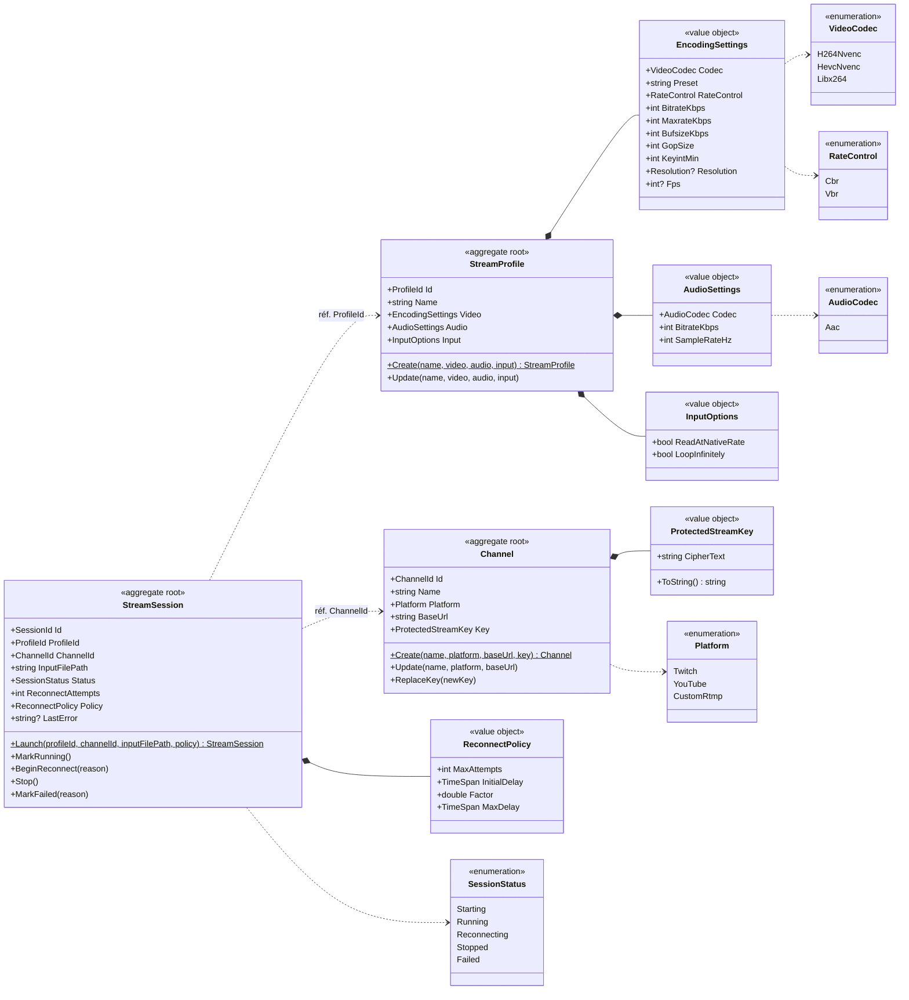
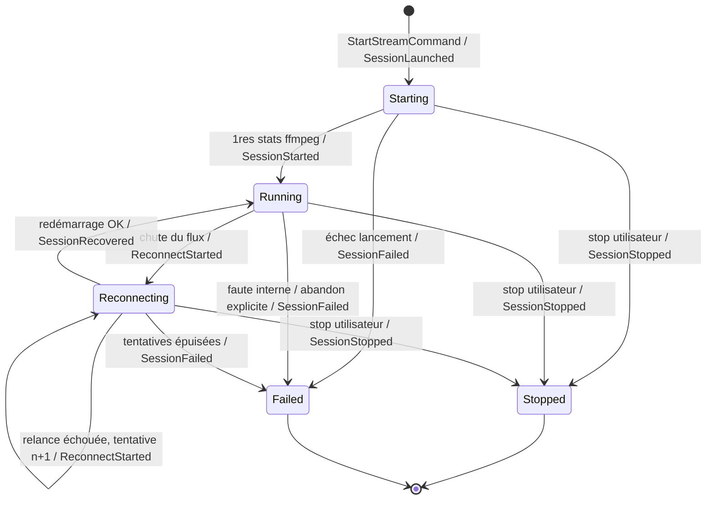
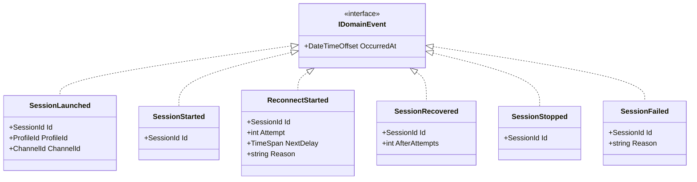
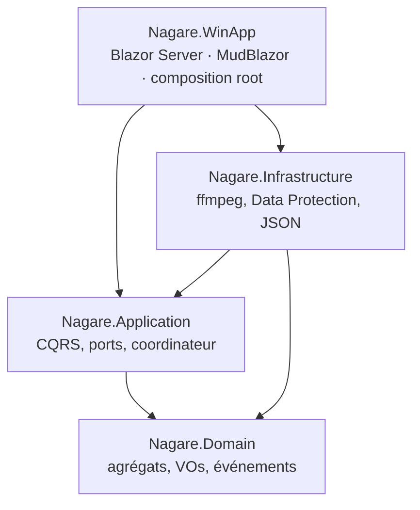

# Nagare — Modèle du domaine (UML mermaid)

> Vue de conception (itération 1). Source : `docs/ARCHITECTURE.md` §2.
> Identifiants en anglais (le code est intégralement en anglais).

## Diagramme de classes



Notes de conception :

- Les trois **agrégats** ne se référencent **que par identifiant** (`ProfileId`,
  `ChannelId`) — jamais par référence objet directe (frontières d'agrégat).
- `EncodingSettings` porte les invariants **E1–E8** (voir ARCHITECTURE.md §2.2),
  validés au constructeur (`DomainException` sinon).
- `ProtectedStreamKey` ne contient **que le chiffré** ; `ToString()` renvoie
  `****`. Le déchiffrement vit en Infrastructure, jamais en Domain/Application.
- `StreamSession` n'est **pas persistée** en itération 1 (vit en mémoire).

## Diagramme d'états — `StreamSession`

Transition / événement de domaine émis :



Règle assumée : un échec en `Starting` va directement en `Failed` (pas de
backoff — la config est probablement fautive). La reconnexion automatique avec
backoff est réservée aux chutes d'un flux **déjà établi** (`Running`).

`Running → Failed` (`MarkFailed`) est l'**abandon explicite** : une faute interne
prive la session de tout ce qui pourrait la faire avancer (plus de process, plus
de timer) — sans cette transition, elle resterait un **zombie** en `Running`. Elle
ne court-circuite **pas** la règle ci-dessus : une sortie de ffmpeg passe toujours
par `BeginReconnect` et consomme une tentative. Elle a été ouverte parce que
l'atteindre via `BeginReconnect` émettait un `ReconnectStarted` **mensonger** dans
la piste d'audit de la session.

**L'auto-transition `Reconnecting → Reconnecting`** est le cœur du backoff : une
relance ffmpeg qui meurt avant d'émettre des stats compte une tentative de plus
(délai `ReconnectPolicy.DelayFor(n)`, exponentiel plafonné). Quand les tentatives
sont épuisées, la session part en `Failed`. Une reconnexion **réussie**
(`MarkRunning`) remet `ReconnectAttempts` à 0 : le budget complet est restauré
pour un futur incident.

> Cette transition manquait au modèle initial, et le garde de `BeginReconnect`
> refusait `Reconnecting` — la branche d'épuisement était donc **inatteignable**
> (aucun backoff progressif, aucun échec après N tentatives). Bug révélé par les
> tests et corrigé (commit `41856d9`).

## Événements de domaine



Dispatch (volontairement minimal, ADR/ARCHITECTURE §2.5) : l'agrégat accumule ses
événements ; le `StreamSessionCoordinator` (Application) draine la collection après
chaque transition et les publie explicitement (notification UI + logs). Pas de bus,
pas de réflexion — `IDomainEventHandler<T>` seulement si un 2ᵉ consommateur apparaît.
```

## Couches (dépendances)


